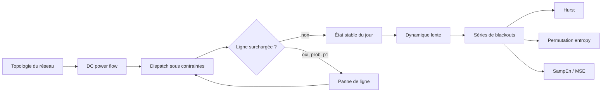

<div align="center">

# cascade-entropy

### Analyse informationnelle des pannes en cascade dans les réseaux électriques de transport

*From DC power flow and cascading failures to slow network evolution and entropy-based diagnostics.*

<p>
  =3.10">
  =1.24">
  =1.10">
  
</p>

<p>
  
  
  
  
  
</p>

**Alex Baker** · Université Laval · Automne 2026  
PHY-3202 — Projet I · Superviseur : **Patrick Desrosiers**  
Concept original : **Nickie Menementis**

[Vue d'ensemble](#vue-densemble) · [Question scientifique](#question-scientifique) · [Modèle](#modèle) · [Résultats](#résultats-actuels) · [Architecture](#architecture-du-dépôt) · [Démarrage](#démarrage-rapide) · [Roadmap](#roadmap)

</div>

---

## Vue d'ensemble

`cascade-entropy` est un projet de physique computationnelle consacré aux **pannes en cascade dans les réseaux électriques de transport** et à l'information contenue dans les séries temporelles qu'elles produisent.

Le projet poursuit deux fils complémentaires :

- **Fil A — physique du réseau :** construire un modèle électrique simplifié, reproduire le mécanisme de cascade de Carreras et al., puis générer des séries temporelles contrôlées de blackouts ;
- **Fil B — théorie de l'information :** tester si l'entropie de permutation, l'entropie d'échantillon et l'entropie multiéchelle apportent une information complémentaire aux indicateurs électriques et statistiques de référence.

Les deux fils sont **séparés** : aucun module du fil B n'importe un module du fil A, et les séries passent d'un fil à l'autre par des fichiers écrits sur disque. La seule dépendance dans l'autre sens est documentée : `evolution` (fil A) importe `entropie.nombre_effectif` (fil B) pour calculer l'une de ses observables.

État au 5 octobre 2026 : **SO1 (Carreras et al., 2002) est fermé**, **SO2 (Carreras et al., 2004) est produit et analysé** avec des écarts documentés, et **SO3** (appliquer les entropies à ces séries) est la prochaine étape.

> **Principe de validation**  
> On ne cherche pas un coefficient manquant pour forcer l'accord avec la littérature. Le protocole est fixé, la physique produit ses résultats, puis l'écart à la référence est **mesuré, quantifié et expliqué**. Chaque résultat est classé : **mesuré** (simulation), **dérivé analytiquement** (formule fermée vérifiée numériquement) ou **hypothèse de réplication** (convention que le papier ne fixe pas). Une réponse négative est un résultat valable.

### État du projet en un coup d'œil

| Étape | Accord obtenu | Résultats négatifs ou ouverts |
|---|---|---|
| **SO1** — Carreras 2002 | **Fig. 3 à 11 reproduites sans coefficient ajusté** ; `M` extérieur = 0.6016 contre 0.601 publié (0.11 %) | Loi de puissance **non établie** (lognormale favorisée) ; point critique de la Fig. 12 à ≈ 8 % |
| **SO2** — Carreras 2004 | Deux régimes selon `G` ; `H(G)` du délestage ; second pic de la Fig. 8 ; deux cycles prédits analytiquement et vérifiés | Fig. 7 (plateau) et Fig. 9 (≈ 30 fois trop de grands blackouts) **non reproduites** ; le `H` court de 0.55 est surtout le biais de R/S |
| **SO3** — entropies | Outils validés sur séries synthétiques | Application aux séries de SO2 à venir |

<p align="center">
  
</p>
<p align="center"><sub>Exemple de réseau en arbre utilisé dans le fil A. L'épaisseur/charge des lignes est produite par le modèle de flux et de dispatch.</sub></p>

---

## Question scientifique

> **Les séries temporelles produites par l'évolution d'un réseau électrique présentent-elles des signatures informationnelles permettant de distinguer des régimes présentant différentes vulnérabilités aux pannes en cascade ? Si oui, ces signatures apportent-elles une information complémentaire aux indicateurs électriques et statistiques déjà utilisés ?**

Le point de comparaison principal est l'analyse de Carreras et al. basée sur l'**exposant de Hurst**. Le projet ne suppose donc pas que les mesures entropiques doivent « gagner » : si elles ne fournissent pas d'information supplémentaire par rapport à la charge, au taux de charge maximal ou au Hurst, ce résultat est lui-même scientifiquement informatif.

### Sous-objectifs

| Sous-objectif | Question | État actuel |
|---|---|---|
| **SO1 — Reproduire le mécanisme de cascade** | Le modèle retrouve-t-il les transitions et structures de référence de Carreras 2002 ? | ✅ **Fermé le 5 octobre 2026** — Fig. 3 à 11 reproduites |
| **SO2 — Produire les séries de blackouts** | La dynamique lente retrouve-t-elle les propriétés temporelles de référence, notamment le comportement de Hurst en fonction de `G` ? | 🟡 **Produit et analysé** (21 cas) : reproduction partielle, écarts documentés |
| **SO3 — Tester l'apport informationnel** | Les entropies séparent-elles les régimes autrement ou plus tôt que les indicateurs classiques ? | 🟡 Outils validés sur séries synthétiques ; application aux séries de SO2 à venir |

---

## Modèle

Le modèle suit une approche **quasi-stationnaire** inspirée de Carreras, Lynch, Dobson et Newman : chaque étape de cascade est un état stationnaire DC, séparé du suivant par une panne de ligne et un nouveau dispatch.



### Flux DC

Pour des injections nodales $\mathbf P$, les angles et les flux sont obtenus dans l'approximation DC :

$$
\mathbf P = \mathbf B\boldsymbol\theta,
\qquad
\mathbf F = \mathbf A\mathbf P.
$$

Le taux de charge d'une ligne $\ell$ est

$$
M_\ell = \frac{|F_\ell|}{F_\ell^{\max}}.
$$

### Dispatch

Le dispatch est formulé comme un **programme linéaire** qui détermine simultanément la production et la charge servie, sous contraintes de capacité des générateurs et des lignes. Le délestage est la différence entre la demande et la charge effectivement servie.

Plusieurs solutions de même coût existent (**dégénérescence du dispatch**). Elles ne changent pas l'optimum global, mais elles changent *où* le délestage est localisé. Ce choix est donc exposé comme une option, `departage`, et non codé en dur :

| Règle | Statut | Effet mesuré |
|---|---|---|
| `highs` | valeur par défaut (comportement historique) | ne reproduit ni la localisation du délestage ni les bandes de la Fig. 10 ; dépend de la plateforme |
| `exterieur_dabord` | **règle de référence** (programme linéaire en deux étapes) | reproduit la couronne extérieure délestée (Fig. 9) et les bandes de la Fig. 10 ; résultats identiques sous Linux et Windows |

`highs` est conservée comme contrôle de sensibilité.

### Cascade rapide

Une journée simulée combine deux mécanismes de panne :

- `p0` — avarie accidentelle, indépendante de la charge ;
- `p1` — avarie conditionnelle à la surcharge.

Après chaque panne, le dispatch est recalculé. La cascade s'arrête lorsqu'aucune nouvelle ligne ne tombe. Les fluctuations de charge sont **corrélées par région** (toutes les charges d'une région partagent le même facteur aléatoire), pour que l'amplitude relative des fluctuations globales ne diminue pas artificiellement quand le réseau grandit.

### Dynamique lente

Le mode `auto_organise` ajoute une mémoire à long terme :

- croissance lente de la demande (1.8 %/an) ;
- augmentation de la capacité de génération lorsque la marge devient insuffisante ;
- renforcement des lignes tombées par surcharge lors d'un blackout.

Cette couche fournit les séries temporelles utilisées dans SO2 et SO3. Chaque paramètre est classé *publié* ou *hypothèse de réplication* dans [`docs/so2_carreras_2004.md`](docs/so2_carreras_2004.md#hypothèses-de-réplication).

**Frontière `G = 1` (dérivé analytiquement).** Avec une marge `G·g` et une demande tirée bornée à `(1 + g)` fois la moyenne, aucun blackout ne peut venir de la génération seule dès que `G ≥ 1`. La séparation des deux régimes à `G ≈ 1` découle donc directement de l'Éq. (5) de Carreras 2004.

---

## Résultats actuels

Cette section donne les résultats principaux. Le détail complet (tableaux, incertitudes, hypothèses, contrôles) est dans deux documents :

> 📄 **SO1 — [`docs/so1_carreras_2002.md`](docs/so1_carreras_2002.md)** : les 14 observables comparées aux valeurs publiées, seuils `r_T(N)`, loi de déclenchement, taille finie, sensibilité au départage, hypothèses de réplication, incohérence du papier.
>
> 📄 **SO2 — [`docs/so2_carreras_2004.md`](docs/so2_carreras_2004.md)** : cibles de validation de Carreras 2004, `H(G)` avec références par mélange, cycles déterministes, contrôles sur `μ`, écarts non reproduits.

### 1. SO1 — validation déterministe (arbre de 382 nœuds)

| Observable (Carreras 2002) | Référence | Modèle | Écart | Nature |
|---|---:|---:|---:|---|
| `M` des lignes extérieures, Table I (`r = 0.8696`) | 0.601 | 0.6016 | 0.11 % | mesuré |
| Dispatch (Fig. 4) | 10 au max · 1 réduit · 1 ≈ 0 | 10 · 1 (0.435) · 1 (0.000) | identique | mesuré |
| Transition de génération (Fig. 5) | 1.00 | 1.005 | 0.5 % | mesuré (pas de 0.005) |
| Transition de transport (Fig. 5) | 1.45 | 1.4453 | 0.3 % | dérivé analytiquement |
| Front de délestage (Fig. 9) | ligne 380 → ≈ 270 | 380 → 269 | n/a | mesuré |
| Bandes ordonnées (Fig. 10) | ≈ 2.07–3.10 · ≈ 4.46–7.18 (lues, ± 0.05) | 2.079–3.066 · 4.512–7.154 | < 1 pas | dérivé analytiquement, confirmé par mesure |

Ces valeurs sont obtenues avec la règle `exterieur_dabord`. Aucun coefficient n'a été ajusté. Dix observables sur quatorze sont validées ; les quatre autres (Fig. 8, point critique et indice de queue de la Fig. 12, Fig. 13) dépendent d'une hypothèse de réplication documentée.

<p align="center">
  
</p>
<p align="center"><sub>Transitions de génération et de transport sur le réseau de 382 nœuds (règle <code>exterieur_dabord</code>).</sub></p>

<p align="center">
  
</p>
<p align="center"><sub>Carte étendue de <code>M</code> : les bandes ordonnées de la Fig. 10 découlent de la Table I seule.</sub></p>

**Seuil de transport (dérivé analytiquement).** Formule fermée, vérifiée par bissection sur le dispatch à `1e-4 %` près : $r_T(N) = F^{\max}_{\ell^*} N_L / (n_{\ell^*} P_C)$, où $\ell^*$ est la ligne extérieure limitante, $n_{\ell^*}$ le nombre de charges en aval et $N_L$ le nombre de charges. Valeurs : 1.992155 (46 nœuds), 1.601537 (94), 1.489931 (190), 1.445289 (382).

**Loi de déclenchement des cascades.** Sans paramètre libre, la fréquence des cascades multi-lignes suit la probabilité qu'au moins une région dépasse le seuil de saturation :

$$
P_{\text{cascade}} = 1 - (1 - p_f)^{N_F},
\qquad
p_f = \frac{\gamma - 0.99/\rho}{2\gamma - 2},
\qquad
\rho = \frac{r}{r_T(N)}.
$$

Les 12 mesures (3 tailles × 4 valeurs de `ρ`) tombent à 1–2 erreurs-types de la prédiction. Cette loi décrit le franchissement d'un seuil par une variable uniforme bornée : sa forme vient des **hypothèses de réplication**, pas d'un comportement critique émergent. Elle montre en revanche que `ρ`, et non le ratio `P_D/P_C`, est le bon paramètre de contrôle pour comparer les tailles.

**Taille finie à `ρ` constant.** La taille des cascades est quantifiée par la structure de l'arbre, saute d'un facteur 10 entre 190 et 382 nœuds et dépend de la partition en régions (`N_F`). L'étendue Δ de la queue croît faiblement avec `N`, mais c'est un estimateur fragile, sans barre d'erreur. **Aucune loi de puissance n'est établie** : la lognormale est favorisée partout. La campagne historique à ratio égal (46 et 94 nœuds) est conservée dans [`docs/`](docs/so1_carreras_2002.md#e--campagne-historique-46-contre-94-nœuds-ratio-égal).

**Incohérence du papier.** Les Fig. 3–4 de Carreras 2002 sont étiquetées `P_D/P_C = 0.3`, mais calculées à la charge de la Table I (`P_D/P_C = 0.8696`) : l'écart de 65.5 % à 0.3 devient 0.11 % à 0.8696. Les [trois arguments](docs/so1_carreras_2002.md#incohérence-du-papier--létiquette--p_dp_c--03--des-fig-34) sont dans `docs/` ; le cas 0.30 reste un témoin.

### 2. SO2 — dynamique lente (Carreras 2004)

Balayage `so2-G-scan` : 46 / 94 / 190 nœuds × 7 valeurs de `G`, 120 000 jours par cas (20 000 de transitoire écartés), analysé avec 50 mélanges temporels par série comme référence. **SO2 est partiellement reproduit.**

| Observable (Carreras 2004) | Résultat | Statut |
|---|---|---|
| Deux régimes selon `G` (Sec. IV) | 94 nœuds : 122 → 3.7 blackouts / 300 j et 0.25 → 8.1 lignes par blackout de `G` = 0.1 à 2 ; même tendance à 46 et 190 | ✓ reproduit |
| `H` long du délestage (Fig. 4a) | ≈ 0.5 pour `G ≤ 0.25`, ≈ 0.24–0.29 pour `G ≥ 0.75` ; même courbe pour les 3 tailles | ✓ qualitatif |
| `H` long des lignes tombées (Fig. 4b) | antipersistant (0.18–0.28) à faible `G` ; à `G` élevé, montée vers 0.9 qui s'atténue avec la taille | ✓ faible `G` · ✗ `G` élevé |
| Distribution des lignes par blackout (Fig. 8) | second pic à 16–17 lignes reproduit ; premier pic (à 4) absent | ~ |
| `H` court (Fig. 3) | 0.52–0.58 contre 0.55 publié, mais ≈ 95 % de cette valeur est le biais de R/S (mélanges : 0.52–0.56) | ~ |
| Fig. 7 (puissance servie) et Fig. 9 (grands blackouts) | plateau dès `G ≈ 0.75` sans baisse à `G` élevé ; ≈ 30 fois trop de blackouts de plus de 15 lignes | ✗ non reproduits |
| Queue du délestage (Table I) | à refaire sur la fréquence cumulée, comme dans le texte de Carreras | ⏳ |

Deux **cycles déterministes** sont prédits analytiquement, sans paramètre ajusté, et vérifiés. Le cycle des lignes a pour période $\ln\mu / \ln\lambda_{\text{jour}}$ : 405 / 998 / 1950 jours prédits pour `μ` = 1.02 / 1.05 / 1.10, 405 / 1000 / 1961 mesurés. Le cycle de la génération a pour intervalle $(k/N_G) / \big((1+G\,g)\ln\lambda_{\text{jour}}\big)$ : de 31.3 à 12.2 jours prédits pour `G` = 0.1 à 2, écart ≤ 0.5 jour sur les 21 cas.

L'hypothèse, non démontrée, est que l'antipersistance des lignes publiée par Carreras (0.2–0.4) soit la signature du même cycle. **Aucune criticalité auto-organisée n'est démontrée.** Détail, contrôles et questions ouvertes : [`docs/so2_carreras_2004.md`](docs/so2_carreras_2004.md).

### Ce que ces résultats permettent, et ne permettent pas, de dire

| Affirmation | État |
|---|---|
| Le modèle électrique et la cascade fonctionnent numériquement | Oui — établi par les tests et les cas analytiques |
| Les transitions macroscopiques de Carreras 2002 sont reproduites | Oui, à moins de 0.5 % |
| Le micro-état déterministe est reproduit (Fig. 3–11) | Oui — l'écart apparent des Fig. 3–4 vient de l'étiquette du papier |
| Une signature de taille finie est observée | Oui, mais Δ est un estimateur fragile, sans barre d'erreur |
| Une loi de puissance est statistiquement établie | Non — la lognormale est favorisée partout |
| La dynamique lente de Carreras 2004 est reproduite | En partie — régimes, `H(G)` du délestage et second pic oui ; Fig. 7, Fig. 9 et Table I non |
| Le `H` court de 0.55 signale une mémoire à courte portée | Non — ≈ 95 % de la valeur est le biais de R/S aux petites échelles |
| Une criticalité auto-organisée est démontrée | Non — plusieurs signatures publiées de SO2 ne sont pas reproduites |
| Les entropies sont déjà liées à la vulnérabilité électrique | Pas encore — c'est précisément SO3 |

---

## Fil B — mesures informationnelles

Les outils sont développés indépendamment du simulateur afin d'être validés d'abord sur des signaux de comportement connu : entropie de Shannon, de répartition et nombre effectif, entropie de permutation, Sample Entropy, entropie multiéchelle (`entropie.py`) ; exposant de Hurst `R/S`, détection du transitoire MSER et diagnostics de queue (`indicateurs.py`) ; mélanges temporels de contrôle (`controles.py`) ; analyse des séries de SO2 (`analyse_series.py`). Liste des modules : [`cascade_entropy/README.md`](cascade_entropy/README.md).

L'entropie de permutation est appliquée à l'entropie de la distribution des taux de charge plutôt qu'à la série de délestage brute : celle-ci est surtout faite de zéros exacts, qui biaisent la mesure.

Le fil B doit répondre à une question simple mais exigeante : **une mesure entropique apporte-t-elle une information que les indicateurs électriques et Hurst ne contiennent pas déjà ?**

---

## Architecture du dépôt

```text
cascade-entropy/
├── cascade_entropy/       # le paquet : fil A (reseau, dispatch, cascade, evolution, carreras),
│                          # fil B (entropie, indicateurs, analyse_series, controles, synthetiques)
│                          # voir cascade_entropy/README.md
│
├── notebooks/
│   ├── 00_fondations_probabilistes.ipynb
│   ├── 01_laboratoire.ipynb
│   ├── 02_modele_evolution.ipynb
│   ├── 03_analyse_entropique.ipynb
│   ├── autres/            # versions antérieures, non maintenues
│   └── README.md
│
├── scripts/
│   ├── 01_croisement_multiechelle.py
│   ├── 02_melange_temporel.py
│   ├── 03_balayage_charge.py              # historique, qualitatif (échelle calibrée)
│   ├── 04_loi_puissance_taille_finie.py   # expérience historique
│   ├── 05_diagnostics_carreras.py         # figures déterministes Fig. 3-11
│   ├── 05_reproduction_carreras.py        # campagnes stochastiques SO1
│   ├── 06_validation_so1.py               # audit chiffré SO1
│   ├── 07_dynamique_lente.py              # production SO2 (cas taille x G)
│   ├── 08_analyse_so2.py                  # analyse SO2 (H, cycles, Fig. 4, 7, 8, 9, Table I)
│   └── README.md                          # options de chaque script
│
├── tests/                 # tests pytest (voir « Reproductibilité »)
├── docs/
│   ├── so1_carreras_2002.md   # détail scientifique de SO1
│   ├── so2_carreras_2004.md   # détail scientifique de SO2
│   ├── 02_melange_temporel.md # expérience du mélange temporel
│   └── journal.md             # journal de bord
├── figures/               # figures de référence versionnées (PNG)
├── data/                  # sorties de simulation : non versionné
├── pyproject.toml
└── README.md
```

> **Convention du projet :** les notebooks racontent la démarche scientifique ; le paquet `cascade_entropy` effectue les calculs réutilisables et testables.

Chaque dossier de code a son propre README : [`cascade_entropy/`](cascade_entropy/README.md) (modules et règle entre les fils A et B), [`scripts/`](scripts/README.md) (options de chaque script) et [`notebooks/`](notebooks/README.md) (politique de versionnement des carnets). Les résultats scientifiques détaillés sont dans [`docs/`](docs/so1_carreras_2002.md).

### Ce qui est versionné, et ce qui ne l'est pas

Les sorties de simulation sont **régénérables** à partir des scripts, des graines et des paramètres enregistrés dans `metadata.json`. Elles ne sont donc pas dans Git :

| Élément | Versionné ? | Pourquoi |
|---|---|---|
| `data/`, `*.npz` | Non | sorties de simulation, volumineuses et régénérables |
| `figures/**/runs/` | Non | figures produites par chaque run (ex. `figures/07_dynamique_lente/runs/<run-id>/`) |
| `figures/**/*.pdf` | Non | doublons vectoriels des PNG, régénérés par les scripts |
| Figures de référence (PNG) | Oui | celles citées dans ce README et dans les rapports |
| `docs/` | Oui | résultats détaillés et journal de bord |
| `donnees_externes/` | Non | aucune donnée externe ne doit entrer dans le dépôt |

Les figures déterministes de `figures/05_reproduction_carreras/deterministe_exterieur_dabord/` se régénèrent avec `python scripts/05_diagnostics_carreras.py --departage exterieur_dabord`.

---

## Démarrage rapide

### Installation

Prérequis : **Python 3.10+** et Git.

```bash
git clone https://github.com/PhD-Brown/cascade-entropy.git
cd cascade-entropy
python -m venv .venv
```

Activer l'environnement :

```bash
# Windows PowerShell
.venv\Scripts\Activate.ps1

# macOS / Linux
source .venv/bin/activate
```

Installer le paquet et les dépendances de développement :

```bash
python -m pip install -e ".[dev]"
python -m pytest -q
```

### Reproduire les résultats

```bash
# SO1 : figures déterministes 3 à 11 (règle de référence) et audit chiffré
python scripts/05_diagnostics_carreras.py --departage exterieur_dabord
python scripts/06_validation_so1.py

# SO2 : balayage en G (3 tailles x 7 valeurs de G, 120 000 jours par cas), puis analyse
python scripts/07_dynamique_lente.py run \
    --tailles 46 94 190 --G 0.1 0.25 0.5 0.75 1.0 1.5 2.0 \
    --jours 120000 --workers 8 --run-id so2-G-scan
python scripts/08_analyse_so2.py --help
```

Un run interrompu se reprend avec `--resume <RUN_ID>`. Les campagnes stochastiques de SO1 (`audit`, `scan`, `production`), toutes les options et les commandes complètes sont dans [`scripts/README.md`](scripts/README.md).

---

## Reproductibilité et validation

300 tests automatisés (au 5 octobre 2026) vérifient notamment :

- des réseaux simples calculables analytiquement ;
- la conservation de puissance ;
- les contraintes de génération et de transport ;
- le comportement de la cascade lorsque `p0` ou `p1` sont nuls ;
- la reproductibilité à graine fixée, y compris la **reprise identique bit pour bit** des simulations lentes ;
- la validation externe contre Carreras 2002 (Fig. 3–4 et seuil de transport du réseau de 382 nœuds) ;
- la robustesse du solveur (stratégies de secours) et l'analyse des séries de SO2 ;
- les mesures entropiques sur des cas de référence ;
- les contrôles d'entrée et les invariants numériques.

Ces tests établissent la **cohérence du code**, pas à eux seuls la validité physique du modèle. La validation scientifique repose sur la comparaison quantitative avec la littérature, avec écarts et incertitudes explicitement documentés dans [`docs/`](docs/so1_carreras_2002.md).

Les campagnes coûteuses (`05_reproduction_carreras.py`, `07_dynamique_lente.py`) sont conçues pour être reprises et comparées : runs isolés et non destructifs (`--run-id`), checkpoints par blocs (`--resume`), graines déterministes par bloc, `metadata.json` et `status.json`. Un résultat est ainsi relié à la version exacte du protocole qui l'a produit. Avec la règle `exterieur_dabord`, les résultats de SO1 sont identiques sous Linux et Windows. Pour les longues trajectoires de SO2, seules les **statistiques** sont comparables d'une machine à l'autre : les trajectoires divergent après ≈ 5 000 jours (un taux de charge à 0.98999… ou 0.99000… franchit ou non le seuil de saturation).

---

## Limites scientifiques actuelles

Le projet repose volontairement sur un modèle simplifié :

- l'approximation DC ne décrit ni la tension, ni la fréquence, ni les transitoires électromécaniques, et la gestion des îlots n'est pas celle d'un simulateur industriel ;
- le dispatch LP est dégénéré : la règle de départage localise le délestage et est une **hypothèse de réplication** ;
- certains paramètres ne sont pas donnés dans les papiers (`N_F`, loi des facteurs régionaux, `g` en SO2) : ils ont un effet fort sur les statistiques de cascade et sont traités comme hypothèses contrôlées ;
- le point critique de la Fig. 12 est reproduit à ≈ 8 % seulement, et une queue visuellement longue ou un exposant ajusté n'établissent pas une loi de puissance ;
- en SO2, les Fig. 7 et 9 ne sont pas reproduites (le modèle manque peut-être d'un couplage entre marge de génération et lignes, que le papier ne décrit pas) ; aucun résultat ne démontre une criticalité auto-organisée ni un lien causal entre entropie et vulnérabilité.

Le dépôt n'est pas destiné à l'exploitation d'un réseau réel : il sert à étudier, dans un cadre contrôlé, les mécanismes et statistiques d'un modèle de cascade.

---

## Roadmap

**Fait** : mesures informationnelles sur signaux synthétiques ; flux DC, dispatch, cascade `p0` / `p1`, évolution multi-jours ; réplication contrôlée de Carreras 2002 et diagnostics déterministes (Fig. 3–11) ; **SO1 fermé** (5 octobre 2026) ; option de départage `exterieur_dabord` ; comparaison à `ρ` constant (94 → 190 → 382) ; dynamique lente de Carreras 2004 ; **balayage en `G` de SO2** (21 cas) et analyse avec références par mélange ; contrôle du cycle des lignes (`μ` = 1.02 et 1.10).

**À faire** :

- [ ] Poser les tags Git `so1-v1` et `so2-v1`
- [ ] Instruire l'écart de la Fig. 7 (plateau pour `G ≥ 1`) et la modulation lente des lignes
- [ ] Refaire la Table I de Carreras 2004 sur la fréquence cumulée relative
- [ ] Barres d'erreur bootstrap sur Δ(N)
- [ ] **SO3** : comparer Hurst, indicateurs électriques, permutation entropy, SampEn et MSE sur les séries de SO2, avec les mêmes références par mélange, et tester si ces signatures apportent une information réellement complémentaire
- [ ] Extensions conditionnelles : réseau IEEE 118, vérification croisée du flux DC avec pandapower, données réelles d'Hydro-Québec

---

## Notebooks

Quatre carnets suivent l'ordre logique du projet (fondations probabilistes, laboratoire de signaux synthétiques, modèle et évolution, analyse entropique) : voir [`notebooks/README.md`](notebooks/README.md).

---

## Remerciements

Ce projet est réalisé sous la supervision de **Patrick Desrosiers** à
l'Université Laval. L'idée originale à l'origine du projet a été proposée
par **Nickie Menementis**.

---

## Références principales

1. B. A. Carreras, V. E. Lynch, I. Dobson & D. E. Newman, **“Critical Points and Transitions in an Electric Power Transmission Model for Cascading Failure Blackouts”**, *Chaos* **12**, 985–994 (2002). DOI: `10.1063/1.1505810`.
2. B. A. Carreras, V. E. Lynch, I. Dobson & D. E. Newman, **“Complex Dynamics of Blackouts in Power Transmission Systems”**, *Chaos* **14**, 643–652 (2004). DOI: `10.1063/1.1781391`.
3. C. Bandt & B. Pompe, **“Permutation Entropy: A Natural Complexity Measure for Time Series”**, *Physical Review Letters* **88**, 174102 (2002). DOI: `10.1103/PhysRevLett.88.174102`.
4. J. S. Richman & J. R. Moorman, **“Physiological Time-Series Analysis Using Approximate Entropy and Sample Entropy”**, *American Journal of Physiology* **278**, H2039–H2049 (2000).
5. M. Costa, A. L. Goldberger & C.-K. Peng, **“Multiscale Entropy Analysis of Complex Physiologic Time Series”**, *Physical Review Letters* **89**, 068102 (2002). DOI: `10.1103/PhysRevLett.89.068102`.

---

## Licence

Ce projet est distribué sous licence **MIT**. Voir [`LICENSE`](LICENSE).

---

<div align="center">

**Research status: active — SO1 closed, SO2 analysed, SO3 next**

*Reproduce first. Measure the discrepancy. Let the physics speak.*

</div>
