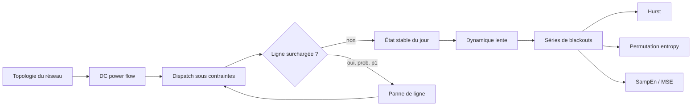

<div align="center">

# cascade-entropy

### Analyse informationnelle des pannes en cascade dans les réseaux électriques de transport

*From DC power flow and cascading failures to slow network evolution and entropy-based diagnostics.*

<p>
  =3.10">
  =1.24">
  =1.10">
  
</p>

<p>
  
  
  
  
  
</p>

**Alex Baker** · Université Laval · Automne 2026  
PHY-3202 — Projet I · Superviseur : **Patrick Desrosiers**

[Vue d'ensemble](#vue-densemble) · [Question scientifique](#question-scientifique) · [Modèle](#modèle) · [Réplication de Carreras](#réplication-de-carreras-2002) · [Résultats](#résultats-actuels) · [Architecture](#architecture-du-dépôt) · [Démarrage](#démarrage-rapide) · [Roadmap](#roadmap)

</div>

---

## Vue d'ensemble

`cascade-entropy` est un projet de physique computationnelle consacré aux **pannes en cascade dans les réseaux électriques de transport** et à l'information contenue dans les séries temporelles qu'elles produisent.

Le projet poursuit deux fils complémentaires :

- **Fil A — physique du réseau :** construire un modèle électrique simplifié, reproduire le mécanisme de cascade de Carreras et al., puis générer des séries temporelles contrôlées de blackouts ;
- **Fil B — théorie de l'information :** tester si l'entropie de permutation, l'entropie d'échantillon et l'entropie multiéchelle apportent une information complémentaire aux indicateurs électriques et statistiques de référence.

Les deux fils sont **strictement séparés** : le fil B n'importe jamais le fil A. Ils ne communiquent que par des fichiers de séries écrits sur disque.

Le dépôt a franchi une étape : la **validation quantitative de SO1 (Carreras et al., 2002) est fermée depuis le 5 octobre 2026**, et le projet est maintenant dans la **réplication de la dynamique lente (SO2, Carreras et al., 2004)**, dont le balayage en `G` est en cours de production. Les séries qui en sortiront alimenteront SO3 (entropies).

> **Principe de validation**  
> On ne cherche pas un coefficient manquant pour forcer l'accord avec la littérature. Le protocole est fixé, la physique produit ses résultats, puis l'écart à la référence est **mesuré, quantifié et expliqué**. Chaque résultat est classé : **mesuré** (simulation), **dérivé analytiquement** (formule fermée vérifiée numériquement) ou **hypothèse de réplication** (convention que le papier ne fixe pas). Une réponse négative est un résultat valable.

### État du projet en un coup d'œil

| Focus actuel | Accord quantitatif obtenu | Résultats négatifs ou ouverts | Production en cours |
|---|---|---|---|
| **SO2** — dynamique lente de Carreras 2004 | **Fig. 3 à 11 de Carreras 2002 reproduites sans coefficient ajusté** ; `M` extérieur = 0.6016 contre 0.601 publié (0.11 %) | Loi de puissance **non établie** (lognormale favorisée) ; point critique de la Fig. 12 à ≈ 8 % | Balayage `so2-G-scan` : 46 / 94 / 190 nœuds × 7 valeurs de `G`, 120 000 jours par cas |

<p align="center">
  
</p>
<p align="center"><sub>Exemple de réseau en arbre utilisé dans le fil A. L'épaisseur/charge des lignes est produite par le modèle de flux et de dispatch.</sub></p>

---

## Question scientifique

> **Les séries temporelles produites par l'évolution d'un réseau électrique présentent-elles des signatures informationnelles permettant de distinguer des régimes présentant différentes vulnérabilités aux pannes en cascade ? Si oui, ces signatures apportent-elles une information complémentaire aux indicateurs électriques et statistiques déjà utilisés ?**

Le point de comparaison principal est l'analyse de Carreras et al. basée sur l'**exposant de Hurst**. Le projet ne suppose donc pas que les mesures entropiques doivent « gagner » : si elles ne fournissent pas d'information supplémentaire par rapport à la charge, au taux de charge maximal ou au Hurst, ce résultat est lui-même scientifiquement informatif.

### Sous-objectifs

| Sous-objectif | Question | État actuel |
|---|---|---|
| **SO1 — Reproduire le mécanisme de cascade** | Le modèle retrouve-t-il les transitions et structures de référence de Carreras 2002 ? | ✅ **Fermé le 5 octobre 2026** — Fig. 3 à 11 reproduites |
| **SO2 — Produire les séries de blackouts** | La dynamique lente retrouve-t-elle les propriétés temporelles de référence, notamment le comportement de Hurst en fonction de `G` ? | 🟡 Code et tests prêts, balayage en `G` en cours, aucune cible encore validée |
| **SO3 — Tester l'apport informationnel** | Les entropies séparent-elles les régimes autrement ou plus tôt que les indicateurs classiques ? | 🟡 Outils validés sur séries synthétiques ; application aux séries de SO2 à venir |

---

## Modèle

Le modèle suit une approche **quasi-stationnaire** inspirée de Carreras, Lynch, Dobson et Newman : chaque étape de cascade est un état stationnaire DC, séparé du suivant par une panne de ligne et un nouveau dispatch.



### Flux DC

Pour des injections nodales $\mathbf P$, les angles et les flux sont obtenus dans l'approximation DC :

$$
\mathbf P = \mathbf B\boldsymbol\theta,
\qquad
\mathbf F = \mathbf A\mathbf P.
$$

Le taux de charge d'une ligne $\ell$ est

$$
M_\ell = \frac{|F_\ell|}{F_\ell^{\max}}.
$$

### Dispatch

Le dispatch est formulé comme un **programme linéaire** qui détermine simultanément la production et la charge servie, sous contraintes de capacité des générateurs et des lignes. Le délestage est la différence entre la demande et la charge effectivement servie.

Plusieurs solutions de même coût existent (**dégénérescence du dispatch**). Elles ne changent pas l'optimum global, mais elles changent *où* le délestage est localisé. Ce choix est donc exposé comme une option, `departage`, et non codé en dur :

| Règle | Statut | Effet mesuré |
|---|---|---|
| `highs` | valeur par défaut (comportement historique) | ne reproduit ni la localisation du délestage ni les bandes de la Fig. 10 ; dépend de la plateforme |
| `exterieur_dabord` | **règle de référence** (programme linéaire en deux étapes) | reproduit la couronne extérieure délestée (Fig. 9) et les bandes de la Fig. 10 ; résultats identiques sous Linux et Windows |

`highs` est conservée comme contrôle de sensibilité.

### Cascade rapide

Une journée simulée combine deux mécanismes de panne :

- `p0` — avarie accidentelle, indépendante de la charge ;
- `p1` — avarie conditionnelle à la surcharge.

Après chaque panne, le dispatch est recalculé. La cascade s'arrête lorsqu'aucune nouvelle ligne ne tombe.

### Dynamique lente

Le mode `auto_organise` ajoute une mémoire à long terme :

- croissance lente de la demande ;
- augmentation de la capacité de génération lorsque la marge devient insuffisante ;
- renforcement des lignes tombées par surcharge lors d'un blackout.

Cette couche fournit les séries temporelles utilisées dans SO2 et SO3. Paramètres de la réplication de Carreras 2004 :

| Élément | Valeur | Statut |
|---|---:|---|
| Croissance de la demande | 1.8 %/an | Publié |
| Seuil de marge $(\Delta P/P)_c$ | $G\cdot g$ (Éq. 5) | Publié ; $\tilde\gamma = g$ déduit |
| Amplitude des fluctuations `g` | 0.9 (comme SO1) | **Hypothèse de réplication** (option `--g`) |
| Type de fluctuation | régionale, `N_F = 3` | **Hypothèse de réplication** (option `--fluctuation`) |
| Renforcement des lignes `μ` | 1.05 | Choisi dans la plage publiée [1.01, 1.1] |
| Ajout de génération `k` | 0.02 | Publié (« a few percent ») |
| `p1` | 1 | Choisi dans la plage publiée [0.1, 1] |
| Transitoire écarté | 20 000 jours | Publié (≈ 20 000, Fig. 2) |
| Durée analysée par cas | 120 000 jours | Choix de production |

**Frontière `G = 1` (dérivé analytiquement).** Avec une marge `G·g` et une demande tirée bornée à `(1 + g)` fois la moyenne, aucun blackout ne peut venir de la génération seule dès que `G ≥ 1`. La séparation des deux régimes à `G ≈ 1` découle donc directement de l'Éq. (5).

---

## Réplication de Carreras 2002

La réplication de référence est isolée dans `cascade_entropy/carreras.py` et les scripts `05_*` et `06_*`. Elle distingue explicitement les **quantités publiées** des **hypothèses nécessaires à la reproduction**.

### Paramètres utilisés

| Élément | Valeur / convention | Statut |
|---|---:|---|
| Tailles d'arbres | 46, 94, 190, 382 nœuds | Publié |
| Nombre de générateurs | 12 | Publié |
| `P_G` | 2623.9 | Publié dans la Table I |
| `P_C = Σ P_j^max = 12 P_G` | 31 486.8 | **Validé** par les Fig. 3–4 et le seuil de transport |
| Capacités de lignes | 15620, 7748.7, 3812.9, 1844.9, 860.97, 368.99, 123.00 | Publié (Table I littérale, indexée depuis la racine) |
| Réactances | 1 | Publié pour les arbres |
| `gamma` | 1.9 | Publié |
| `p0` | `1e-4` | Publié |
| Critère de saturation | `M ≥ 0.99` | Publié (« à moins de 1 % ») |
| Réalisations | 60 000 par jeu de paramètres (campagne historique) ; 1000 par point (validation à `ρ` constant) | Choix de production |
| `N_F` | 3 régions (les trois branches) | **Hypothèse de réplication, effet fort** |
| Loi des facteurs régionaux | uniforme sur `[2-gamma, gamma]` | **Hypothèse de réplication, effet fort** |
| `p1` | 1 (Fig. 11 conforme pour 0, 0.1 et 1) | **Hypothèse de réplication** |
| Départage du délestage | `exterieur_dabord` (référence) | **Hypothèse de réplication, option** |

Les fluctuations de charge sont **corrélées par région** : toutes les charges d'une même région partagent le même facteur aléatoire. Cette correction évite que l'amplitude relative des fluctuations globales diminue artificiellement lorsque le réseau grandit.

**Incohérence du papier.** Les Fig. 3–4 sont étiquetées `P_D/P_C = 0.3`, mais elles ont été calculées à la charge nominale de la Table I (`P_D/P_C = 0.8696`). Trois arguments indépendants : (1) à `r = 0.3` le modèle donne `M_ext = 0.2076` (65.5 % d'écart) alors qu'à `r = 0.8696` il donne 0.6016 (0.11 %) ; (2) à `r = 0.3` seuls 3 générateurs pleins sont possibles, alors que la Fig. 4 en montre 10 ; (3) relire `P_C` pour sauver l'étiquette 0.3 contredirait la Fig. 5. Le cas `r = 0.30` est conservé comme témoin dans les diagnostics.

### Infrastructure expérimentale

`scripts/05_reproduction_carreras.py` et `scripts/07_dynamique_lente.py` sont conçus pour les campagnes coûteuses :

- runs isolés et non destructifs, identifiés par `--run-id` ;
- checkpoints par blocs et reprise après interruption avec `--resume` ;
- graines déterministes par bloc ;
- parallélisation multi-processus (`--workers`) ;
- `metadata.json` (paramètres et graines), `status.json` et journal texte ;
- export des distributions, statistiques de queue et tailles de cascade.

`scripts/05_diagnostics_carreras.py` est le banc de validation déterministe des **Fig. 3 à 11** du papier de 2002, et `scripts/06_validation_so1.py` en est l'audit chiffré (Fig. 3–4, seuils `r_T(N)`, cibles `ρ`, bandes de la Fig. 10).

---

## Résultats actuels

### 1. SO1 — validation déterministe (arbre de 382 nœuds)

| Observable (Carreras 2002) | Référence | Modèle | Écart | Nature |
|---|---:|---:|---:|---|
| `M` des lignes extérieures, Table I (`r = 0.8696`) | 0.601 | 0.6016 | 0.11 % | mesuré |
| Dispatch (Fig. 4) | 10 au max · 1 réduit · 1 ≈ 0 | 10 · 1 (0.435) · 1 (0.000) | identique | mesuré |
| Transition de génération (Fig. 5) | 1.00 | 1.005 | 0.5 % | mesuré (pas de 0.005) |
| Transition de transport (Fig. 5) | 1.45 | 1.4453 | 0.3 % | dérivé analytiquement |
| Front de délestage (Fig. 9) | ligne 380 → ≈ 270 | 380 → 269 | — | mesuré |
| Bandes ordonnées (Fig. 10) | ≈ 2.07–3.10 · ≈ 4.46–7.18 (lues, ± 0.05) | 2.079–3.066 · 4.512–7.154 | < 1 pas | dérivé analytiquement, confirmé par mesure |

Ces valeurs sont obtenues avec la règle `exterieur_dabord`. Aucun coefficient n'a été ajusté.

**Seuil de transport.** Le seuil déterministe suit une formule fermée, vérifiée par bissection sur le dispatch à `1e-4 %` près :

$$
r_T(N) = \frac{F^{\max}_{\ell^*}\, N_L}{n_{\ell^*}\, P_C}
$$

où $\ell^*$ est la ligne extérieure limitante, $n_{\ell^*}$ le nombre de charges en aval et $N_L$ le nombre de charges.

| N | 46 | 94 | 190 | 382 |
|---|---:|---:|---:|---:|
| `r_T` analytique | 1.992155 | 1.601537 | 1.489931 | 1.445289 |

Seul l'arbre de 382 nœuds sature ses niveaux 4 à 7 en même temps, condition de conception décrite par Carreras. Pour 46 nœuds, le seuil fluctué dépasse la limite de génération : cette taille est exclue de la série principale à `ρ` constant.

<p align="center">
  
</p>
<p align="center"><sub>Transitions de génération et de transport sur le réseau de 382 nœuds (règle <code>exterieur_dabord</code>).</sub></p>

<p align="center">
  
</p>
<p align="center"><sub>Carte étendue de <code>M</code> : les bandes ordonnées de la Fig. 10 découlent de la Table I seule.</sub></p>

### 2. Loi de déclenchement des cascades

La fréquence des cascades multi-lignes suit, **sans paramètre libre**, la probabilité qu'au moins une région dépasse le seuil de saturation :

$$
P_{\text{cascade}} = 1 - (1 - p_f)^{N_F},
\qquad
p_f = \frac{\gamma - 0.99/\rho}{2\gamma - 2},
\qquad
\rho = \frac{r}{r_T(N)}.
$$

| `ρ` | Prédiction (`N_F = 3`) | 94 | 190 | 382 |
|---:|---:|---:|---:|---:|
| 0.50 | 0 % | 0.0 % | 0.0 % | 0.0 % |
| 0.526 | 3.1 % | 4.2 % | 2.5 % | 3.4 % |
| 0.55 | 15.7 % | 16.1 % | 14.3 % | 16.3 % |
| 0.60 | 36.2 % | 38.6 % | 36.5 % | 34.6 % |

Les 12 mesures tombent à 1–2 erreurs-types de la prédiction (erreur-type Monte-Carlo de 0.5 à 1.5 %, 1000 réalisations par point). Cette loi décrit le franchissement d'un seuil par une variable uniforme bornée : sa forme vient donc des **hypothèses de réplication** (loi uniforme, `N_F`), pas d'un comportement critique émergent. Elle montre aussi que `ρ`, et non le ratio `P_D/P_C`, est le bon paramètre de contrôle pour comparer les tailles.

### 3. Taille finie à `ρ` constant (`N_F = 3`, 1000 réalisations, règle `exterieur_dabord`)

| `ρ` | N | Fréquence de blackout | Taille moyenne des cascades (si > 0) | Δ (décades) |
|---:|---:|---:|---:|---:|
| 0.526 | 94 | 30.0 % | 5.7 | 0.55 |
| 0.526 | 190 | 22.2 % | 5.9 | 0.79 |
| 0.526 | 382 | 20.9 % | 54 | 0.89 |
| 0.55 | 94 | 40.2 % | 8.0 | 1.35 |
| 0.55 | 190 | 30.9 % | 7.8 | 1.34 |
| 0.55 | 382 | 30.2 % | 80 | 1.46 |

- **Quantification.** La taille des cascades est fixée par la structure de l'arbre : 8 lignes = le niveau 4 d'une branche, 120 lignes = les niveaux 4 à 7 d'une branche. Seul l'arbre de 382 nœuds perd une périphérie de branche entière.
- **Contrôle `N_F = 1`.** Sur 382 nœuds, le quantum de 120 disparaît au profit de ≈ 255–358 lignes (trois branches) : la taille des cascades dépend de la partition en régions.
- **Fragilité de Δ.** Δ varie jusqu'à 0.17 décade sur des échantillons presque identiques (choix de `x_min` par KS). C'est un estimateur fragile, sans barre d'erreur pour l'instant, à ne pas utiliser seul pour conclure.
- **Loi de puissance.** Le rapport de vraisemblance loi de puissance / lognormale est négatif partout : **aucune loi de puissance n'est établie**.

### 4. Campagne historique 46 vs 94 nœuds (ratio égal)

Cette première campagne, antérieure à la règle `exterieur_dabord` et au passage à `ρ` comme paramètre de comparaison, fixait un ratio commun `P_D/P_C = 0.84` avant le run confirmatoire (60 000 réalisations par taille). Elle est conservée comme résultat historique.

| Mesure | 46 nœuds | 94 nœuds |
|---|---:|---:|
| Fréquence de blackout | 27.67 % | 29.66 % |
| `D_KS` de l'ajustement power-law | 0.13073 | 0.12073 |
| Points dans la queue | 7 184 | 8 000 |
| Étendue `Δ = log10(xmax/xmin)` | **0.583** décade | **0.820** décade |

La région de queue s'étend d'environ 41 % de 46 à 94 nœuds, mais la lognormale reste favorisée : les exposants `alpha` de cet ajustement ne sont **pas** des exposants physiques validés.

<p align="center">
  
</p>
<p align="center"><sub>CCDF des tailles de blackout (campagne historique) : l'effet de taille finie apparaît, mais la courbure des queues empêche de conclure à une loi de puissance.</sub></p>

<p align="center">
  
</p>
<p align="center"><sub>Distribution du nombre de lignes tombées (campagne historique) : des cascades multi-lignes apparaissent sur 94 nœuds, jusqu'à 17 lignes.</sub></p>

### 5. SO2 — premiers essais (préliminaires)

**Aucune cible de SO2 n'est encore validée.** Les valeurs ci-dessous viennent d'essais courts sur 46 nœuds, avec un `R/S` simple sur le régime stationnaire et sans intervalle de référence. L'analyse complète (deux plages, intervalles obtenus par mélange des séries) est la prochaine étape.

| Observable (Carreras 2004) | Référence publiée | Essais | Statut |
|---|---|---|---|
| `H` aux échelles courtes (Fig. 3) | 0.55 ± 0.02 | 0.556 (`G = 0.5`) | préliminaire |
| `H` long du délestage (Fig. 4a) | ≈ 0.5 si `G < 1`, diminue si `G > 1` | 0.46 (`G = 0.5`) · 0.37 (`G = 1`) | préliminaire |
| `H` long des lignes tombées (Fig. 4b) | 0.2–0.4 (antipersistant) | 0.49 (`G = 0.5`) · 0.88 (`G = 1`, non interprétable) | à surveiller |

### Ce que ces résultats permettent — et ne permettent pas — de dire

| Affirmation | État |
|---|---|
| Le modèle électrique et la cascade fonctionnent numériquement | Oui — établi par les tests et les cas analytiques |
| Les transitions macroscopiques de Carreras 2002 sont reproduites | Oui, à moins de 0.5 % |
| Le micro-état déterministe est reproduit (Fig. 3–11) | Oui — l'écart apparent des Fig. 3–4 vient de l'étiquette du papier |
| Une signature de taille finie est observée | Oui, mais Δ est un estimateur fragile, sans barre d'erreur |
| Des cascades multi-lignes émergent avec la taille | Oui, avec une taille quantifiée par la structure de l'arbre et dépendante de `N_F` |
| Une loi de puissance est statistiquement établie | Non — la lognormale est favorisée partout |
| Une criticalité auto-organisée est démontrée | Non — la dynamique lente (SO2) n'est pas encore validée |
| Les entropies sont déjà liées à la vulnérabilité électrique | Pas encore — c'est précisément SO3 |

---

## Fil B — mesures informationnelles

Les outils d'analyse sont développés indépendamment du simulateur afin d'être validés d'abord sur des signaux de comportement connu.

| Mesure / outil | Module | Rôle |
|---|---|---|
| Entropie de Shannon | `entropie.py` | Incertitude d'une distribution discrète |
| Entropie de répartition | `entropie.py` | Concentration spatiale des flux / taux de charge |
| Nombre effectif | `entropie.py` | Taille effective d'une distribution de poids |
| Entropie de permutation | `entropie.py` | Structure des motifs ordinaux d'une série |
| Sample Entropy | `entropie.py` | Irrégularité / récurrence locale |
| Multiscale Entropy | `entropie.py` | Structure à plusieurs échelles temporelles |
| Exposant de Hurst `R/S`, MSER | `indicateurs.py` | Corrélations à longue portée ; détection du transitoire |
| Survie / power-law diagnostics | `indicateurs.py` | Analyse des distributions de tailles |
| Mélanges temporels | `controles.py` | Contrôle : mêmes valeurs, ordre temporel détruit |

L'entropie de permutation est appliquée à l'entropie de la distribution des taux de charge plutôt qu'à la série de délestage brute : celle-ci est surtout faite de zéros exacts, qui biaisent la mesure.

Le fil B doit répondre à une question simple mais exigeante : **une mesure entropique apporte-t-elle une information que les indicateurs électriques et Hurst ne contiennent pas déjà ?**

---

## Architecture du dépôt

```text
cascade-entropy/
├── cascade_entropy/
│   ├── reseau.py          # topologie, matrices électriques, flux DC
│   ├── dispatch.py        # dispatch LP, charge servie, délestage, option departage
│   ├── cascade.py         # p0 / p1 et propagation d'une cascade
│   ├── evolution.py       # dynamique multi-jours, fluctuations régionales, reprise
│   ├── carreras.py        # protocole contrôlé Carreras 2002, bandes ordonnées
│   ├── entropie.py        # Shannon, permutation, SampEn, MSE...
│   ├── indicateurs.py     # Hurst R/S, MSER, survie, diagnostics de queue
│   ├── controles.py       # témoins / permutations temporelles
│   ├── figures.py         # visualisations réutilisables
│   └── _validation.py     # validation commune des entrées
│
├── notebooks/
│   ├── 00_fondations_probabilistes.ipynb
│   ├── 01_laboratoire.ipynb
│   ├── 02_modele_evolution.ipynb
│   └── 03_analyse_entropique.ipynb
│
├── scripts/
│   ├── 01_croisement_multiechelle.py
│   ├── 02_melange_temporel.py
│   ├── 03_balayage_charge.py
│   ├── 04_loi_puissance_taille_finie.py   # expérience historique
│   ├── 05_diagnostics_carreras.py         # figures déterministes Fig. 3-11
│   ├── 05_reproduction_carreras.py        # campagnes stochastiques SO1
│   ├── 06_validation_so1.py               # audit chiffré SO1
│   └── 07_dynamique_lente.py              # production SO2 (cas taille x G)
│
├── tests/                 # tests pytest (voir « Reproductibilité »)
├── docs/                  # journal de bord (docs/journal.md)
├── figures/               # figures de référence versionnées (PNG)
├── data/                  # sorties de simulation : non versionné
├── pyproject.toml
└── README.md
```

> **Convention du projet :** les notebooks racontent la démarche scientifique ; le paquet `cascade_entropy` effectue les calculs réutilisables et testables.

### Ce qui est versionné, et ce qui ne l'est pas

Les sorties de simulation sont **régénérables** à partir des scripts, des graines et des paramètres enregistrés dans `metadata.json`. Elles ne sont donc pas dans Git :

| Élément | Versionné ? | Pourquoi |
|---|---|---|
| `data/`, `*.npz` | Non | sorties de simulation, volumineuses et régénérables |
| `figures/**/runs/` | Non | figures produites par chaque run (ex. `figures/07_dynamique_lente/runs/<run-id>/`) |
| `figures/**/*.pdf` | Non | doublons vectoriels des PNG, régénérés par les scripts |
| Figures de référence (PNG) | Oui | celles citées dans ce README et dans les rapports |
| `donnees_externes/` | Non | aucune donnée externe ne doit entrer dans le dépôt |

Les figures déterministes de `figures/05_reproduction_carreras/deterministe_exterieur_dabord/` se régénèrent avec `scripts/05_diagnostics_carreras.py`.

---

## Démarrage rapide

### Installation

Prérequis : **Python 3.10+** et Git.

```bash
git clone https://github.com/PhD-Brown/cascade-entropy.git
cd cascade-entropy
python -m venv .venv
```

Activer l'environnement :

```bash
# Windows PowerShell
.venv\Scripts\Activate.ps1

# macOS / Linux
source .venv/bin/activate
```

Installer le paquet et les dépendances de développement :

```bash
python -m pip install -e ".[dev]"
python -m pytest -q
```

> **Note :** le script de réplication Carreras utilise actuellement le package `powerlaw`, qui n'est pas encore déclaré dans `pyproject.toml`. Pour exécuter les analyses de queue : `python -m pip install powerlaw`.

### Reproduire les diagnostics Carreras 2002

```bash
python scripts/05_diagnostics_carreras.py
```

Balayage déterministe plus fin :

```bash
python scripts/05_diagnostics_carreras.py --pas 0.0025
```

### Lancer une campagne stochastique (SO1)

Audit rapide :

```bash
python scripts/05_reproduction_carreras.py audit
```

Scan contrôlé :

```bash
python scripts/05_reproduction_carreras.py scan \
    --tailles 46 94 \
    --ratio-min 0.60 --ratio-max 0.90 --pas 0.01 \
    --n 2500 --chunk-size 250 --workers 16
```

Production confirmatoire (campagne historique à ratio égal) :

```bash
python scripts/05_reproduction_carreras.py production \
    --tailles 46 94 \
    --ratio 0.84 \
    --n 60000 \
    --chunk-size 1000 \
    --workers 16
```

Un run interrompu peut être repris avec `--resume <RUN_ID>`.

### Lancer la dynamique lente (SO2)

Essai court (un cas) :

```bash
python scripts/07_dynamique_lente.py run \
    --tailles 46 --G 1.0 --jours 32000 --transitoire 20000 \
    --run-id essai-so2
```

Balayage en `G` (3 tailles × 7 valeurs de `G`, 120 000 jours par cas) :

```bash
python scripts/07_dynamique_lente.py run \
    --tailles 46 94 190 \
    --G 0.1 0.25 0.5 0.75 1.0 1.5 2.0 \
    --jours 120000 --workers 8 --run-id so2-G-scan
```

Reprise après interruption (les paramètres sont relus depuis `metadata.json`) :

```bash
python scripts/07_dynamique_lente.py run --resume so2-G-scan --workers 8
```

---

## Reproductibilité et validation

Plus de 240 tests automatisés vérifient notamment :

- des réseaux simples calculables analytiquement ;
- la conservation de puissance ;
- les contraintes de génération et de transport ;
- le comportement de la cascade lorsque `p0` ou `p1` sont nuls ;
- la reproductibilité à graine fixée, y compris la **reprise identique bit pour bit** des simulations lentes ;
- la validation externe contre Carreras 2002 (Fig. 3–4 et seuil de transport du réseau de 382 nœuds) ;
- les mesures entropiques sur des cas de référence ;
- les contrôles d'entrée et les invariants numériques.

Ces tests établissent la **cohérence du code**, pas à eux seuls la validité physique du modèle. La validation scientifique repose sur la comparaison quantitative avec la littérature, avec écarts et incertitudes explicitement documentés.

Les campagnes lourdes conservent leurs paramètres, graines, checkpoints et métadonnées afin qu'un résultat puisse être relié à la version exacte du protocole qui l'a produit. Avec la règle `exterieur_dabord`, les résultats sont identiques sous Linux et Windows.

---

## Limites scientifiques actuelles

Le projet repose volontairement sur un modèle simplifié. En particulier :

- l'approximation DC ne décrit ni la tension, ni la fréquence, ni les transitoires électromécaniques complets ;
- la gestion physique détaillée des îlots n'est pas celle d'un simulateur industriel ;
- le dispatch LP est dégénéré : la règle de départage localise le délestage et est une **hypothèse de réplication** (la Fig. 8 de Carreras est elle-même décrite comme dépendante du solveur dans la région erratique) ;
- certains paramètres nécessaires à la réplication ne sont pas donnés dans les papiers (`N_F`, loi des facteurs régionaux, `g` en SO2) : ils ont un effet fort sur les statistiques de cascade et sont traités comme hypothèses contrôlées ;
- le point critique de la Fig. 12 est reproduit à ≈ 8 % seulement (début des cascades à `r = 0.753` contre ≈ 0.70) ;
- une queue visuellement longue ou un exposant ajusté ne suffisent pas à établir une loi de puissance, et Δ est un estimateur fragile ;
- la dynamique lente (SO2) n'est pas encore validée : aucun résultat ne démontre à ce stade une criticalité auto-organisée ni un lien causal entre entropie et vulnérabilité.

Le dépôt n'est pas destiné à l'exploitation d'un réseau réel : il sert à étudier, dans un cadre contrôlé, les mécanismes et statistiques d'un modèle de cascade.

---

## Roadmap

- [x] Implémenter les mesures informationnelles sur signaux synthétiques
- [x] Implémenter le DC power flow et les réseaux en arbre
- [x] Implémenter le dispatch de production / charge servie
- [x] Implémenter la cascade journalière `p0` / `p1`
- [x] Implémenter l'évolution multi-jours et le mode auto-organisé
- [x] Construire une réplication Carreras 2002 contrôlée et reproductible
- [x] Mettre en place les diagnostics déterministes des Fig. 3–11
- [x] Obtenir une première signature finite-size reproductible 46 → 94
- [x] **Fermer quantitativement SO1** (5 octobre 2026) : Fig. 3–11 reproduites, écart des Fig. 3–4 expliqué
- [x] Option de départage du délestage (`exterieur_dabord` en référence) et tests associés
- [x] Étendre la comparaison de taille à `ρ` constant (94 → 190 → 382 ; 46 exclu de la série principale)
- [x] Implémenter la dynamique lente de Carreras 2004 (fluctuations régionales, reprise exacte, diagnostic du transitoire)
- [ ] Poser le tag Git `so1-v1`
- [ ] Barres d'erreur bootstrap sur Δ(N)
- [ ] **Balayage en `G` de SO2** (en cours) et validation du régime stationnaire
- [ ] Reproduire le comportement de Hurst en fonction de `G`, ainsi que les Fig. 7–9 et la Table I de Carreras 2004
- [ ] Comparer Hurst, indicateurs électriques, permutation entropy, SampEn et MSE
- [ ] Tester si les signatures informationnelles apportent une information réellement complémentaire
- [ ] Extensions conditionnelles : réseau IEEE 118, vérification croisée du flux DC avec pandapower, données réelles d'Hydro-Québec

---

## Notebooks

Les quatre notebooks principaux suivent l'ordre logique du projet :

| Notebook | Rôle |
|---|---|
| `00_fondations_probabilistes.ipynb` | Probabilités, Shannon, ordres relatifs et bases des mesures informationnelles |
| `01_laboratoire.ipynb` | Validation des méthodes sur des signaux synthétiques connus |
| `02_modele_evolution.ipynb` | Fil A complet : réseau → dispatch → cascade → évolution → réplication Carreras |
| `03_analyse_entropique.ipynb` | Interface avec le fil B et premières analyses informationnelles des séries électriques |

---

## Références principales

1. B. A. Carreras, V. E. Lynch, I. Dobson & D. E. Newman, **“Critical Points and Transitions in an Electric Power Transmission Model for Cascading Failure Blackouts”**, *Chaos* **12**, 985–994 (2002). DOI: `10.1063/1.1505810`.
2. B. A. Carreras, V. E. Lynch, I. Dobson & D. E. Newman, **“Complex Dynamics of Blackouts in Power Transmission Systems”**, *Chaos* **14**, 643–652 (2004). DOI: `10.1063/1.1781391`.
3. C. Bandt & B. Pompe, **“Permutation Entropy: A Natural Complexity Measure for Time Series”**, *Physical Review Letters* **88**, 174102 (2002). DOI: `10.1103/PhysRevLett.88.174102`.
4. J. S. Richman & J. R. Moorman, **“Physiological Time-Series Analysis Using Approximate Entropy and Sample Entropy”**, *American Journal of Physiology* **278**, H2039–H2049 (2000).
5. M. Costa, A. L. Goldberger & C.-K. Peng, **“Multiscale Entropy Analysis of Complex Physiologic Time Series”**, *Physical Review Letters* **89**, 068102 (2002). DOI: `10.1103/PhysRevLett.89.068102`.

---

## Licence

Ce projet est distribué sous licence **MIT**. Voir [`LICENSE`](LICENSE).

---

<div align="center">

**Research status: active — SO2 slow dynamics (SO1 closed)**

*Reproduce first. Measure the discrepancy. Let the physics speak.*

</div>
