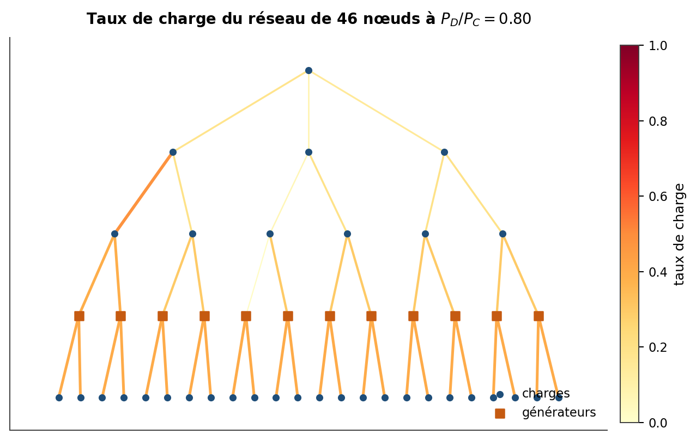
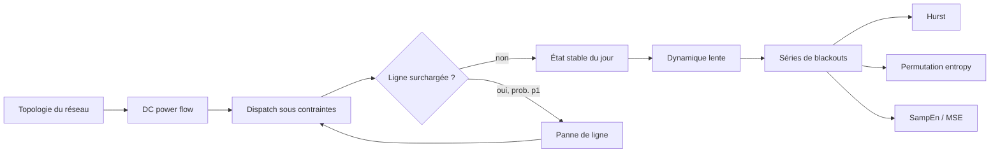
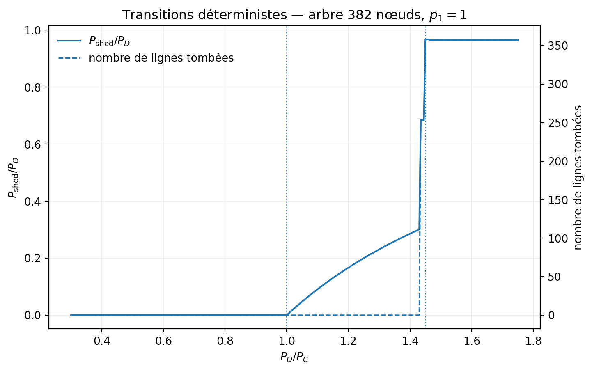
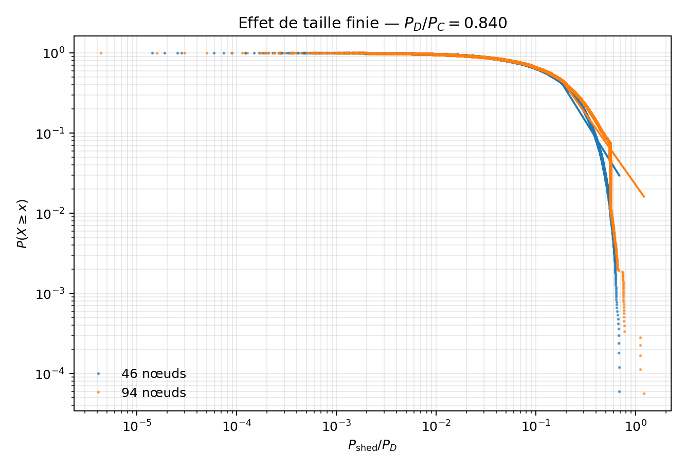
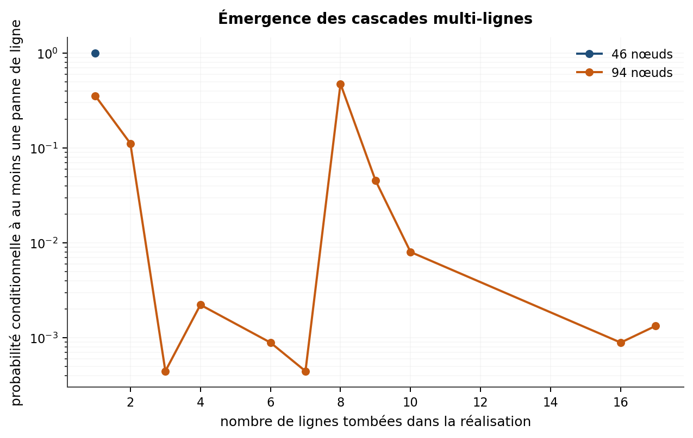

<div align="center">

# cascade-entropy

### Analyse informationnelle des pannes en cascade dans les réseaux électriques de transport

*From DC power flow and cascading failures to slow network evolution and entropy-based diagnostics.*

<p>
  =3.10">
  =1.24">
  =1.10">
  
</p>

<p>
  
  
  
  
</p>

**Alex Baker** · Université Laval · Automne 2026  
PHY-3202 — Projet I · Superviseur : **Patrick Desrosiers**

[Vue d'ensemble](#vue-densemble) · [Question scientifique](#question-scientifique) · [Modèle](#modèle) · [Réplication de Carreras](#réplication-de-carreras-2002) · [Résultats](#résultats-actuels) · [Architecture](#architecture-du-dépôt) · [Démarrage](#démarrage-rapide) · [Roadmap](#roadmap)

</div>

---

## Vue d'ensemble

`cascade-entropy` est un projet de physique computationnelle consacré aux **pannes en cascade dans les réseaux électriques de transport** et à l'information contenue dans les séries temporelles qu'elles produisent.

Le projet poursuit deux fils complémentaires :

- **Fil A — physique du réseau :** construire un modèle électrique simplifié, reproduire le mécanisme de cascade de Carreras et al., puis générer des séries temporelles contrôlées de blackouts ;
- **Fil B — théorie de l'information :** tester si l'entropie de permutation, l'entropie d'échantillon et l'entropie multiéchelle apportent une information complémentaire aux indicateurs électriques et statistiques de référence.

Le dépôt est actuellement dans une phase de **validation quantitative du fil A**. Le simulateur fonctionne déjà de bout en bout, mais la priorité est maintenant de mesurer explicitement sa fidélité aux résultats de référence avant d'utiliser ses séries pour tirer des conclusions sur Hurst ou les entropies.

> **Principe de validation**  
> On ne cherche pas un coefficient manquant pour forcer l'accord avec la littérature. Le protocole est fixé, la physique produit ses résultats, puis l'écart à la référence est **mesuré, quantifié et expliqué** autant que possible.

### État du projet en un coup d'œil

| Focus actuel | Accord quantitatif déjà obtenu | Écart ouvert le plus important | Campagne confirmatoire actuelle |
|---|---|---|---|
| **Fermer SO1** — validation Carreras 2002 | transitions globales à ≈ **0.5–1.0 %** de la référence | Fig. 3 basse charge : ≈ **65.5 %** d'écart sur `M_ext` | **120 000** réalisations indépendantes au total pour 46 + 94 nœuds |

<p align="center">
  
</p>
<p align="center"><sub>Exemple de réseau en arbre utilisé dans le fil A. L'épaisseur/charge des lignes est produite par le modèle de flux et de dispatch.</sub></p>

---

## Question scientifique

> **Les séries temporelles produites par l'évolution d'un réseau électrique présentent-elles des signatures informationnelles permettant de distinguer des régimes présentant différentes vulnérabilités aux pannes en cascade ? Si oui, ces signatures apportent-elles une information complémentaire aux indicateurs électriques et statistiques déjà utilisés ?**

Le point de comparaison principal est l'analyse de Carreras et al. basée sur l'**exposant de Hurst**. Le projet ne suppose donc pas que les mesures entropiques doivent « gagner » : si elles ne fournissent pas d'information supplémentaire par rapport à la charge, au taux de charge maximal ou au Hurst, ce résultat est lui-même scientifiquement informatif.

### Sous-objectifs

| Sous-objectif | Question | État actuel |
|---|---|---|
| **SO1 — Reproduire le mécanisme de cascade** | Le modèle retrouve-t-il les transitions et structures de référence de Carreras 2002 ? | 🟡 **Validation quantitative en cours** |
| **SO2 — Produire les séries de blackouts** | La dynamique lente retrouve-t-elle les propriétés temporelles de référence, notamment le comportement de Hurst en fonction de `G` ? | 🟡 Moteur implémenté, réplication longue à venir |
| **SO3 — Tester l'apport informationnel** | Les entropies séparent-elles les régimes autrement ou plus tôt que les indicateurs classiques ? | 🟡 Méthodes implémentées et testées ; interprétation physique à venir |

---

## Modèle

Le modèle suit une approche **quasi-stationnaire** inspirée de Carreras, Lynch, Dobson et Newman : chaque étape de cascade est un état stationnaire DC, séparé du suivant par une panne de ligne et un nouveau dispatch.



### Flux DC

Pour des injections nodales \(\mathbf P\), les angles et les flux sont obtenus dans l'approximation DC :

$$
\mathbf P = \mathbf B\boldsymbol\theta,
\qquad
\mathbf F = \mathbf A\mathbf P.
$$

Le taux de charge d'une ligne \(\ell\) est

$$
M_\ell = \frac{|F_\ell|}{F_\ell^{\max}}.
$$

### Dispatch

Le dispatch est formulé comme un **programme linéaire** qui détermine simultanément la production et la charge servie, sous contraintes de capacité des générateurs et des lignes. Le délestage est la différence entre la demande et la charge effectivement servie.

Un point important reste ouvert : plusieurs solutions de même coût peuvent exister. La **dégénérescence du dispatch** peut donc modifier la répartition des générateurs et certaines saturations sans modifier l'optimum global.

### Cascade rapide

Une journée simulée combine deux mécanismes de panne :

- `p0` — avarie accidentelle, indépendante de la charge ;
- `p1` — avarie conditionnelle à la surcharge.

Après chaque panne, le dispatch est recalculé. La cascade s'arrête lorsqu'aucune nouvelle ligne ne tombe.

### Dynamique lente

Le mode `auto_organise` ajoute une mémoire à long terme :

- croissance lente de la demande ;
- augmentation de la capacité de génération lorsque la marge devient insuffisante ;
- renforcement des lignes tombées par surcharge lors d'un blackout.

Cette couche fournit les séries temporelles qui seront utilisées dans SO2 et SO3.

---

## Réplication de Carreras 2002

La réplication de référence est isolée dans `cascade_entropy/carreras.py` et les scripts `05_*`. Elle distingue explicitement les **quantités publiées** des **hypothèses nécessaires à la reproduction**.

### Paramètres actuellement utilisés

| Élément | Valeur / convention | Statut |
|---|---:|---|
| Tailles d'arbres | 46, 94, 190, 382 nœuds | Publié |
| Nombre de générateurs | 12 | Publié |
| `P_G` | 2623.9 | Publié dans la Table I |
| Capacités de lignes | 15620, 7748.7, 3812.9, 1844.9, 860.97, 368.99, 123.00 | Publié |
| Réactances | 1 | Publié pour les arbres |
| `gamma` | 1.9 | Publié |
| `p0` | `1e-4` | Publié |
| Réalisations de l'expérience statistique | 60 000 par jeu de paramètres | Publié |
| `N_F` | 3 régions principales | **Hypothèse contrôlée** |
| Loi des facteurs régionaux | uniforme sur `[2-gamma, gamma]` | **Hypothèse contrôlée** |
| `p1` | 1 dans les expériences de référence actuelles | **Hypothèse de réplication** |
| `P_C = Σ P_j^max = 12 P_G` | convention de travail actuelle | **Sous audit** contre les Fig. 3–4 |

Les fluctuations de charge sont **corrélées par région** : toutes les charges d'une même région partagent le même facteur aléatoire. Cette correction évite que l'amplitude relative des fluctuations globales diminue artificiellement lorsque le réseau grandit.

### Infrastructure expérimentale

`scripts/05_reproduction_carreras.py` est conçu pour les campagnes coûteuses :

- runs isolés et non destructifs ;
- checkpoints par blocs ;
- reprise après interruption avec `--resume` ;
- graines déterministes par bloc ;
- parallélisation multi-processus ;
- `metadata.json`, `status.json` et journal texte ;
- export des distributions, statistiques de queue et tailles de cascade.

`scripts/05_diagnostics_carreras.py` sert de banc de validation déterministe pour les **Fig. 3 à 11** du papier de 2002.

---

## Résultats actuels

### 1. Validation déterministe — ce qui colle et ce qui ne colle pas encore

Le réseau de 382 nœuds reproduit déjà très précisément les **deux transitions macroscopiques** rapportées par Carreras :

| Observable | Référence Carreras | Simulation actuelle | Écart relatif | Lecture actuelle |
|---|---:|---:|---:|---|
| Transition de génération `P_D/P_C` | 1.00 | ≈ **1.005** | ≈ **0.5 %** | Très proche |
| Première transition de transport | 1.45 | ≈ **1.435** | ≈ **1.0 %** | Très proche |
| `M` extérieur à `P_D/P_C = 0.30` | **0.601** | ≈ **0.2076** | ≈ **65.5 %** | **Écart majeur à comprendre** |

Le dernier point est actuellement le diagnostic le plus important : les seuils globaux sont proches, mais le **micro-état de basse charge** ne reproduit pas encore celui du papier. Le projet traite cet écart comme une information à expliquer, pas comme quelque chose à recalibrer a posteriori.

<p align="center">
  
</p>
<p align="center"><sub>Diagnostic déterministe sur le réseau de 382 nœuds : transitions de génération et de transport.</sub></p>

### 2. Expérience finite-size contrôlée — 46 vs 94 nœuds

Le scan 46–94 a fixé **avant le run confirmatoire** un ratio commun

$$
\frac{P_D}{P_C}=0.84,
$$

choisi selon un critère commun basé sur la distance KS, avec un minimum d'observations dans chaque queue. Une nouvelle production indépendante de **60 000 réalisations par taille** a ensuite été exécutée.

| Mesure | 46 nœuds | 94 nœuds |
|---|---:|---:|
| Fréquence de blackout | 27.67 % | 29.66 % |
| `σ / P_D` des fluctuations globales | 0.30145 | 0.30146 |
| `D_KS` de l'ajustement power-law | 0.13073 | 0.12073 |
| Points dans la queue | 7 184 | 8 000 |
| Étendue `Δ = log10(xmax/xmin)` | **0.583** décade | **0.820** décade |
| Meilleur `alpha` power-law disponible | 2.9997 | 2.7645 |

La région de queue ajustée s'étend donc d'environ **41 %** en passant de 46 à 94 nœuds :

$$
\Delta_{94} > \Delta_{46}.
$$

Cette signature a survécu à un jeu de données confirmatoire indépendant.

**Mais la loi de puissance n'est pas confirmée.** Les comparaisons de vraisemblance favorisent fortement une lognormale (`R_PL/LN < 0` avec une amplitude très importante). Les exposants `alpha` ci-dessus décrivent donc seulement le meilleur ajustement power-law disponible — **pas un exposant physique validé**.

<p align="center">
  
</p>
<p align="center"><sub>CCDF des tailles de blackout : l'effet de taille finie apparaît, mais la courbure des queues empêche pour l'instant de conclure à une loi de puissance.</sub></p>

### 3. Émergence de cascades multi-lignes

L'effet de taille ne se limite pas à étirer une distribution :

- sur le réseau de **46 nœuds**, les événements de ligne observés dans la campagne confirmatoire sont essentiellement des déclenchements uniques ;
- sur le réseau de **94 nœuds**, des cascades multi-lignes apparaissent clairement, avec des événements atteignant jusqu'à **17 lignes** dans l'échantillon actuel.

<p align="center">
  
</p>

### Ce que ces résultats permettent — et ne permettent pas — de dire

| Affirmation | État |
|---|---|
| Le modèle électrique et la cascade fonctionnent numériquement | Oui - Établi par les tests et cas analytiques |
| Les transitions macroscopiques de Carreras 2002 sont proches | Oui, à ≈0.5–1 % dans l'audit actuel |
| Le micro-état déterministe est entièrement reproduit | Non — Fig. 3–4 restent ouvertes |
| Une signature de taille finie est observée entre 46 et 94 | Oui |
| Des cascades multi-lignes émergent avec la taille | Oui dans l'échantillon actuel |
| Une loi de puissance est statistiquement établie | Non — la lognormale est actuellement favorisée |
| Une criticalité auto-organisée est démontrée | Non — la dynamique lente de référence reste à valider |
| Les entropies sont déjà liées à la vulnérabilité électrique | Pas encore — c'est précisément SO3 |

---

## Fil B — mesures informationnelles

Les outils d'analyse sont développés indépendamment du simulateur afin d'être validés d'abord sur des signaux de comportement connu.

| Mesure / outil | Module | Rôle |
|---|---|---|
| Entropie de Shannon | `entropie.py` | Incertitude d'une distribution discrète |
| Entropie de répartition | `entropie.py` | Concentration spatiale des flux / taux de charge |
| Nombre effectif | `entropie.py` | Taille effective d'une distribution de poids |
| Entropie de permutation | `entropie.py` | Structure des motifs ordinaux d'une série |
| Sample Entropy | `entropie.py` | Irrégularité / récurrence locale |
| Multiscale Entropy | `entropie.py` | Structure à plusieurs échelles temporelles |
| Exposant de Hurst `R/S` | `indicateurs.py` | Corrélations à longue portée |
| Survie / power-law diagnostics | `indicateurs.py` | Analyse des distributions de tailles |
| Mélanges temporels | `controles.py` | Contrôle : mêmes valeurs, ordre temporel détruit |

Le fil B doit répondre à une question simple mais exigeante : **une mesure entropique apporte-t-elle une information que les indicateurs électriques et Hurst ne contiennent pas déjà ?**

---

## Architecture du dépôt

```text
cascade-entropy/
├── cascade_entropy/
│   ├── reseau.py          # topologie, matrices électriques, flux DC
│   ├── dispatch.py        # dispatch LP, charge servie, délestage
│   ├── cascade.py         # p0 / p1 et propagation d'une cascade
│   ├── evolution.py       # dynamique multi-jours et mémoire lente
│   ├── carreras.py        # protocole contrôlé Carreras 2002
│   ├── entropie.py        # Shannon, permutation, SampEn, MSE...
│   ├── indicateurs.py     # Hurst, survie, diagnostics de queue
│   ├── controles.py       # témoins / permutations temporelles
│   ├── figures.py         # visualisations réutilisables
│   └── _validation.py     # validation commune des entrées
│
├── notebooks/
│   ├── 00_fondations_probabilistes.ipynb
│   ├── 01_laboratoire.ipynb
│   ├── 02_modele_evolution.ipynb
│   └── 03_analyse_entropique.ipynb
│
├── scripts/
│   ├── 01_croisement_multiechelle.py
│   ├── 02_melange_temporel.py
│   ├── 03_balayage_charge.py
│   ├── 04_loi_puissance_taille_finie.py   # expérience historique
│   ├── 05_diagnostics_carreras.py
│   └── 05_reproduction_carreras.py        # réplication de référence
│
├── tests/
├── docs/
├── figures/
├── data/
├── pyproject.toml
└── README.md
```

> **Convention du projet :** les notebooks racontent la démarche scientifique ; le paquet `cascade_entropy` effectue les calculs réutilisables et testables.

---

## Démarrage rapide

### Installation

Prérequis : **Python 3.10+** et Git.

```bash
git clone https://github.com/PhD-Brown/cascade-entropy.git
cd cascade-entropy
python -m venv .venv
```

Activer l'environnement :

```bash
# Windows PowerShell
.venv\Scripts\Activate.ps1

# macOS / Linux
source .venv/bin/activate
```

Installer le paquet et les dépendances de développement :

```bash
python -m pip install -e ".[dev]"
python -m pytest
```

> **Note :** le script de réplication Carreras utilise actuellement le package `powerlaw`, qui n'est pas encore déclaré dans `pyproject.toml`. Pour exécuter les analyses de queue : `python -m pip install powerlaw`.

### Reproduire les diagnostics Carreras

```bash
python scripts/05_diagnostics_carreras.py
```

Balayage déterministe plus fin :

```bash
python scripts/05_diagnostics_carreras.py --pas 0.0025
```

### Lancer une campagne finite-size

Audit rapide :

```bash
python scripts/05_reproduction_carreras.py audit
```

Scan contrôlé :

```bash
python scripts/05_reproduction_carreras.py scan \
    --tailles 46 94 \
    --ratio-min 0.60 --ratio-max 0.90 --pas 0.01 \
    --n 2500 --chunk-size 250 --workers 16
```

Production confirmatoire :

```bash
python scripts/05_reproduction_carreras.py production \
    --tailles 46 94 \
    --ratio 0.84 \
    --n 60000 \
    --chunk-size 1000 \
    --workers 16
```

Un run interrompu peut être repris avec `--resume <RUN_ID>`.

---

## Reproductibilité et validation

Les tests automatisés vérifient notamment :

- des réseaux simples calculables analytiquement ;
- la conservation de puissance ;
- les contraintes de génération et de transport ;
- le comportement de la cascade lorsque `p0` ou `p1` sont nuls ;
- la reproductibilité à graine fixée ;
- les mesures entropiques sur des cas de référence ;
- les contrôles d'entrée et les invariants numériques.

Ces tests établissent la **cohérence du code**, pas à eux seuls la validité physique du modèle. La validation scientifique repose sur la comparaison quantitative avec la littérature, avec écarts et incertitudes explicitement documentés.

Les campagnes lourdes conservent leurs paramètres, graines, checkpoints et métadonnées afin qu'un résultat puisse être relié à la version exacte du protocole qui l'a produit.

---

## Limites scientifiques actuelles

Le projet repose volontairement sur un modèle simplifié. En particulier :

- l'approximation DC ne décrit ni la tension, ni la fréquence, ni les transitoires électromécaniques complets ;
- la gestion physique détaillée des îlots n'est pas celle d'un simulateur industriel ;
- le dispatch LP peut être dégénéré et le choix du sommet optimal peut influencer les saturations ;
- certains paramètres nécessaires à la réplication de Carreras ne sont pas explicitement donnés dans le papier et sont donc traités comme hypothèses contrôlées ;
- la fidélité des Fig. 3–4 de Carreras 2002 n'est pas encore obtenue ;
- une queue visuellement longue ou un exposant ajusté ne suffisent pas à établir une loi de puissance ;
- les résultats actuels ne démontrent pas encore une criticalité auto-organisée ni un lien causal entre entropie et vulnérabilité.

Le dépôt n'est pas destiné à l'exploitation d'un réseau réel : il sert à étudier, dans un cadre contrôlé, les mécanismes et statistiques d'un modèle de cascade.

---

## Roadmap

- [x] Implémenter les mesures informationnelles sur signaux synthétiques
- [x] Implémenter le DC power flow et les réseaux en arbre
- [x] Implémenter le dispatch de production / charge servie
- [x] Implémenter la cascade journalière `p0` / `p1`
- [x] Implémenter l'évolution multi-jours et le mode auto-organisé
- [x] Construire une réplication Carreras 2002 contrôlée et reproductible
- [x] Mettre en place les diagnostics déterministes des Fig. 3–11
- [x] Obtenir une première signature finite-size reproductible 46 → 94
- [ ] **Fermer quantitativement SO1** : comprendre les écarts Fig. 3–4 et établir un tableau de validation avec incertitudes
- [ ] Étendre proprement le finite-size scaling 46 → 94 → 190 → 382
- [ ] Valider le régime stationnaire de la dynamique lente
- [ ] Reproduire le comportement de Hurst en fonction du paramètre `G`
- [ ] Comparer Hurst, indicateurs électriques, permutation entropy, SampEn et MSE
- [ ] Tester si les signatures informationnelles apportent une information réellement complémentaire

---

## Notebooks

Les quatre notebooks principaux suivent l'ordre logique du projet :

| Notebook | Rôle |
|---|---|
| `00_fondations_probabilistes.ipynb` | Probabilités, Shannon, ordres relatifs et bases des mesures informationnelles |
| `01_laboratoire.ipynb` | Validation des méthodes sur des signaux synthétiques connus |
| `02_modele_evolution.ipynb` | Fil A complet : réseau → dispatch → cascade → évolution → réplication Carreras |
| `03_analyse_entropique.ipynb` | Interface avec le fil B et premières analyses informationnelles des séries électriques |

---

## Références principales

1. B. A. Carreras, V. E. Lynch, I. Dobson & D. E. Newman, **“Critical Points and Transitions in an Electric Power Transmission Model for Cascading Failure Blackouts”**, *Chaos* **12**, 985–994 (2002). DOI: `10.1063/1.1505810`.
2. B. A. Carreras, V. E. Lynch, I. Dobson & D. E. Newman, **“Complex Dynamics of Blackouts in Power Transmission Systems”**, *Chaos* **14**, 643–652 (2004). DOI: `10.1063/1.1781391`.
3. C. Bandt & B. Pompe, **“Permutation Entropy: A Natural Complexity Measure for Time Series”**, *Physical Review Letters* **88**, 174102 (2002). DOI: `10.1103/PhysRevLett.88.174102`.
4. J. S. Richman & J. R. Moorman, **“Physiological Time-Series Analysis Using Approximate Entropy and Sample Entropy”**, *American Journal of Physiology* **278**, H2039–H2049 (2000).
5. M. Costa, A. L. Goldberger & C.-K. Peng, **“Multiscale Entropy Analysis of Complex Physiologic Time Series”**, *Physical Review Letters* **89**, 068102 (2002). DOI: `10.1103/PhysRevLett.89.068102`.

---

## Licence

Ce projet est distribué sous licence **MIT**. Voir [`LICENSE`](LICENSE).

---

<div align="center">

**Research status: active — SO1 quantitative validation**

*Reproduce first. Measure the discrepancy. Let the physics speak.*

</div>
