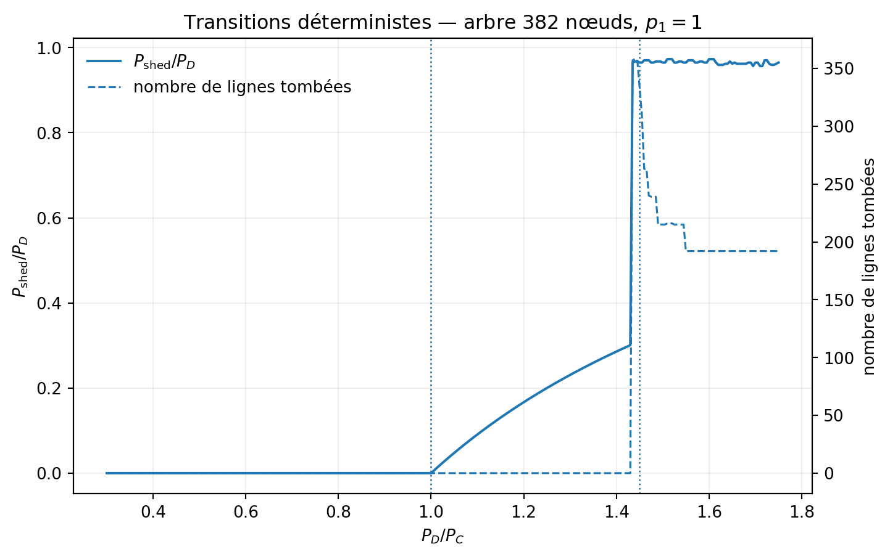
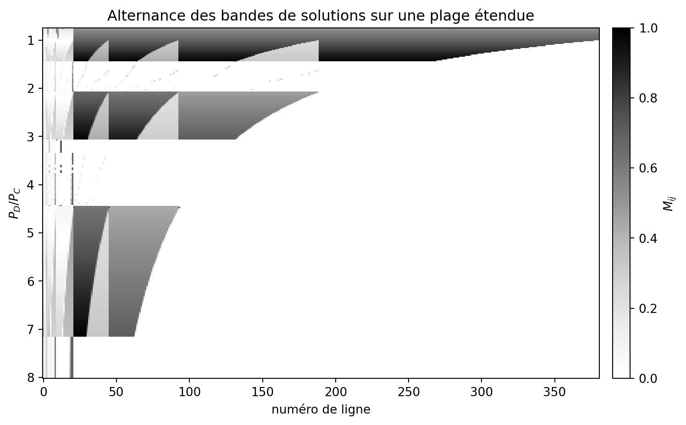

# SO1 : réplication de Carreras et al. (2002)

*Mécanisme de cascade, transitions et micro-état déterministe sur des arbres de 46, 94, 190 et 382 nœuds.*

Ce document est le détail scientifique de SO1. Le [README racine](../README.md) n'en garde que les résultats principaux. État : **SO1 est fermé depuis le 5 octobre 2026**. Le modèle reproduit les transitions et le micro-état déterministe de Carreras et al. (2002) à moins de 0.5 %, **sans aucun paramètre recalibré**. Avec le départage `exterieur_dabord`, la localisation du délestage et les bandes de la Fig. 10 sont aussi reproduites : plus aucun écart non expliqué.

**Navigation** : [Synthèse](#synthèse) · [Paramètres](#paramètres-utilisés) · [Hypothèses](#hypothèses-de-réplication) · [A. Comparaison aux valeurs publiées](#a--comparaison-aux-résultats-publiés-382-nœuds-sauf-mention) · [B. Seuils de transport](#b--seuils-de-transport-r_tn) · [C. Loi de déclenchement](#c--loi-de-déclenchement-des-cascades) · [D. Taille finie](#d--taille-finie-à-ρ-constant-n_f--3-1000-réalisations) · [E. Campagne historique](#e--campagne-historique-46-contre-94-nœuds-ratio-égal) · [Incohérence du papier](#incohérence-du-papier--létiquette--p_dp_c--03--des-fig-34) · [Provenance](#provenance)

## Comment lire les statuts

Chaque ligne compare une valeur publiée à la valeur produite par le code, avec l'écart relatif et son incertitude. L'incertitude est de nature numérique (pas de balayage, tolérance du solveur), statistique (erreur-type Monte-Carlo) ou de définition (critère de saturation à 0.99). Chaque résultat est aussi classé : **mesuré** (simulation), **dérivé analytiquement** (formule fermée vérifiée numériquement) ou **hypothèse de réplication** (convention que le papier ne fixe pas).

- **✓** : accord dans l'incertitude, ou écart < 1 % expliqué.
- **~** : accord qualitatif, ou dépendant d'une hypothèse de réplication documentée.
- **✗** : écart non expliqué ou comportement publié non reproduit.

## Synthèse

- **Fig. 3–4** : `M` des lignes extérieures = 0.6016 contre 0.601 publié (0.11 %), dispatch 10 / 1 / 1 identique, au ratio de la Table I `r = 0.8696`.
- **Transitions** : génération 1.005 (publié 1.00) ; transport 1.4453 analytique (publié 1.45).
- **Seuil de transport** : formule fermée `r_T(N)`, vérifiée à 1e-4 % pour 46 / 94 / 190 / 382 nœuds.
- **Loi de déclenchement des cascades** : `1 − (1 − p_f)^N_F`, sans paramètre libre, 12 mesures sur 12 à 1–2 erreurs-types.
- **Fig. 9–10** : avec `exterieur_dabord`, la couronne extérieure est délestée en premier et les bandes ordonnées tombent sur les frontières analytiques. Résultats identiques sous Linux et Windows ; la règle `highs` ne l'est pas.
- **Résultats négatifs** : aucune loi de puissance établie (la lognormale est favorisée partout) ; point critique de la Fig. 12 reproduit à ≈ 8 % seulement ; Δ (étendue de la queue) est un estimateur fragile.
- **Incohérence du papier** : l'étiquette « `P_D/P_C = 0.3` » des Fig. 3–4 contredit la Table I (voir [plus bas](#incohérence-du-papier--létiquette--p_dp_c--03--des-fig-34)).

## Paramètres utilisés

La réplication de référence est isolée dans `cascade_entropy/carreras.py` et les scripts `05_*` et `06_*`. Elle distingue explicitement les **quantités publiées** des **hypothèses nécessaires à la reproduction**.

| Élément | Valeur / convention | Statut |
|---|---:|---|
| Tailles d'arbres | 46, 94, 190, 382 nœuds | Publié |
| Nombre de générateurs | 12 | Publié |
| `P_G` | 2623.9 | Publié dans la Table I |
| `P_C = Σ P_j^max = 12 P_G` | 31 486.8 | **Validé** par les Fig. 3–4 et le seuil de transport |
| Capacités de lignes | 15620, 7748.7, 3812.9, 1844.9, 860.97, 368.99, 123.00 | Publié (Table I littérale, indexée depuis la racine) |
| Réactances | 1 | Publié pour les arbres |
| `gamma` | 1.9 | Publié |
| `p0` | `1e-4` | Publié |
| Critère de saturation | `M ≥ 0.99` | Publié (« à moins de 1 % ») |
| Réalisations | 60 000 par jeu de paramètres (campagne historique) ; 1000 par point (validation à `ρ` constant) | Choix de production |
| `N_F` | 3 régions (les trois branches) | **Hypothèse de réplication, effet fort** |
| Loi des facteurs régionaux | uniforme sur `[2-gamma, gamma]` | **Hypothèse de réplication, effet fort** |
| `p1` | 1 (Fig. 11 conforme pour 0, 0.1 et 1) | **Hypothèse de réplication** |
| Départage du délestage | `exterieur_dabord` (référence) | **Hypothèse de réplication, option** |

Les fluctuations de charge sont **corrélées par région** : toutes les charges d'une même région partagent le même facteur aléatoire. Cette correction évite que l'amplitude relative des fluctuations globales diminue artificiellement lorsque le réseau grandit.

Paramètres communs des campagnes : `P_G = 2623.9`, `P_C = 31 486.8`, `γ = 1.9`, `p0 = 1e-4`, `p1 = 1`, graine de scan 20261003. Résultats reproduits à l'identique sous Linux et Windows le 3 octobre 2026.

## Hypothèses de réplication

Sept conventions encadrent la réplication ; quatre ne sont pas fixées par le papier, et trois ont un effet fort sur les statistiques de cascade.

| Hypothèse | Valeur retenue | Source | Effet mesuré | Statut |
|---|---|---|---|---|
| `P_C` | 12 × `P_G` = 31 486.8 | Table I + définition `P_C = Σ P_j^max` | confirmé par Fig. 3, Fig. 4 et seuil de transport | ✓ validé |
| Capacités des lignes | Table I littérale, indexée depuis la racine | Table I | `r_T` varie de 1.99 (46) à 1.45 (382) ; seul le 382 sature tous ses niveaux ensemble | ~ conçue pour le 382 |
| Nombre de régions `N_F` | 3 (les trois branches) | non publié | fixe la taille des cascades (120 lignes contre ≈ 255–358 si `N_F = 1`) | ~ effet fort |
| Loi des facteurs régionaux | uniforme sur `[2 − γ, γ]` | bornes seules publiées | détermine la loi de déclenchement (section C) | ~ effet fort |
| `p1` | 1 | non redonné pour la Fig. 12 | Fig. 11 conforme pour 0, 0.1, 1 | ~ |
| Critère de saturation | `M ≥ 0.99` | publié (« à moins de 1 % ») | ouvre la fenêtre de cascades à `ρ = 1/γ` | ✓ publié |
| Départage entre optima de même coût | option `--departage` : `highs` (défaut) ou `exterieur_dabord` | le papier utilise un simplex | localisation du délestage et bandes de la Fig. 10 : reproduites avec `exterieur_dabord`, absentes avec `highs` | ~ option ; `exterieur_dabord` recommandé |

## A : comparaison aux résultats publiés (382 nœuds sauf mention)

Dix observables sur quatorze sont validées (✓) et quatre dépendent d'une hypothèse de réplication (~), avec le départage `exterieur_dabord`. Le départage historique `highs` échoue sur les lignes marquées †.

| Observable (Carreras 2002) | Référence | Modèle | Écart | Incertitude | Statut |
|---|---|---|---|---|---|
| `M` des lignes extérieures, Fig. 3 (Table I, `P_L = −74`, `r = 0.8696`) | 0.601 | 0.601635 | 0.11 % | ± 1e-5 (solveur) ; 3 chiffres publiés | ✓ |
| Dispatch, Fig. 4 | 10 au max · 1 réduit · 1 ≈ 0 | 10 · 1 (0.435) · 1 (0.000) | identique | l'indice du générateur partiel dépend du solveur | ✓ |
| Transition de génération, Fig. 5 | 1.00 | 1.005 | 0.5 % | pas de balayage 0.005 | ✓ |
| Transition de transport, Fig. 5 | 1.45 | 1.4453 (`M = 1`, analytique) · 1.4308 (`M = 0.99`) | 0.3 % | définition du seuil : 1 % | ✓ |
| Fig. 6, `r = 1.04` : génération au max, aucune ligne saturée | qualitatif | `M_max = 0.72` | n/a | n/a | ✓ |
| Fig. 7, `r = 1.45` : plusieurs lignes à `M = 1` (état initial) | qualitatif | `M_max` initial = 0.996–1.000 | n/a | n/a | ✓ |
| Fig. 11 : saut nul (`p1 = 0`), intermédiaire (0.1), maximal (1) | qualitatif | 0 · ≈ 0.67 · 0.965 | n/a | 20 répétitions à `p1 = 0.1` | ✓ |
| Localisation du délestage entre 1 et 1.45 † | couronne extérieure délestée progressivement | 112 charges extérieures coupées à `r = 1.43`, toutes les intérieures servies | n/a | `highs` : l'inverse (couronne servie) | ✓ |
| Fig. 9 : front de délestage et « demi-lunes » † | front de la ligne 380 (`r = 1`) à ≈ 270 (`r = 1.45`) | 380 → 269, ombres grises sur les niveaux 4–6 | n/a | orientation fixée par le terme de rang | ✓ |
| Fig. 10 : bandes ordonnées (arbres de 190 et 94 nœuds) † | ≈ 2.07–3.10 · ≈ 4.46–7.18 (lues, ± 0.05) | analytique 2.079–3.066 · 4.512–7.154 ; mesuré 2.09–3.05 · 4.47–7.15 | < 1 pas | pas de balayage 0.02 | ✓ |
| Fig. 8, `r = 1.73` : peu de lignes en service, `M` faibles | qualitatif | 192 lignes perdues (couronne), délestage 0.81 | n/a | région erratique dépendante du solveur selon Carreras | ~ |
| Fig. 12 : point critique (`γ = 1.9`) | ≈ 0.70 (« 30 % sous la limite de génération ») | début des cascades `r = 0.753` | ≈ 8 % | dépend de la loi uniforme et de `N_F` | ~ |
| Fig. 12 : indice de queue sous le seuil / au seuil | −2 / −1 | `α` effectif 2.13–2.19 à `ρ = 1/γ` ; 1.2–1.4 à `ρ = 0.55–0.60` | n/a | loi de puissance rejetée face à la lognormale | ~ |
| Fig. 13 : la région algébrique s'étend avec `N` | qualitatif | Δ croît faiblement 94 → 190 → 382 à `ρ` fixe | n/a | 1000 réalisations, pas de barre d'erreur ; à refaire avec `exterieur_dabord` | ~ |

Les bornes des bandes de la Fig. 10 découlent de la Table I seule : `r_début = N_L / N_L(D)` quand la génération sature, `r_fin` = seuil de transport de l'arbre restreint aux niveaux ≤ `D` (`carreras.bandes_ordonnees`).

  

Fig. 5 : transitions de génération et de transport sur le réseau de 382 nœuds (règle <code>exterieur_dabord</code>).

  

Fig. 10 : carte étendue de <code>M</code>. Les bandes ordonnées découlent de la Table I seule.

## B : seuils de transport `r_T(N)`

Le seuil de transport déterministe suit une formule fermée, **dérivée analytiquement** puis vérifiée par bissection sur le dispatch à 1e-4 % près (la tolérance numérique de 1e-6 sur `M`).

$$
r_T(N) = \frac{F^{\max}_{\ell^*}\, N_L}{n_{\ell^*}\, P_C}
$$

où $\ell^*$ est la ligne extérieure limitante, $n_{\ell^*}$ le nombre de charges en aval, $N_L$ le nombre de charges et $P_C = 12 \times 2623.9 = 31\,486.8$.

| N | `N_L` | Niveau limitant | Charges en aval | `r_T` analytique | `r_T` numérique | `r` à `M = 0.99` | `r_T / γ` |
|---|---|---|---|---|---|---|---|
| 46 | 34 | 4 | 1 | 1.992155 | 1.992153 | 1.972234 | 1.0485 |
| 94 | 82 | 4 | 3 | 1.601537 | 1.601535 | 1.585521 | 0.8429 |
| 190 | 178 | 4 | 7 | 1.489931 | 1.489930 | 1.475032 | 0.7842 |
| 382 | 370 | 4 | 15 | 1.445289 | 1.445288 | 1.430836 | 0.7607 |

Seul le 382 sature ses niveaux 4 à 7 en même temps, condition de conception décrite par Carreras. Pour le 46, le seuil fluctué (1.05) dépasse la limite de génération : il est exclu de la série principale.

## C : loi de déclenchement des cascades

La fréquence des cascades multi-lignes suit, **sans paramètre libre**, la probabilité qu'au moins une région dépasse le seuil de saturation. Les 12 mesures tombent sur la prédiction à 1–2 erreurs-types près.

$$
P_{\text{cascade}} = 1 - (1 - p_f)^{N_F}, \qquad p_f = \frac{\gamma - 0.99/\rho}{2\gamma - 2}, \qquad \rho = \frac{r}{r_T(N)}
$$

| `ρ` | Prédiction `N_F = 3` | 94 | 190 | 382 | Prédiction `N_F = 1` | 382, `N_F = 1` | Statut |
|---|---|---|---|---|---|---|---|
| 0.50 | 0 % | 0.0 % | 0.0 % | 0.0 % | n/a | n/a | ✓ |
| 0.526 | 3.1 % | 4.2 % | 2.5 % | 3.4 % | 1.1 % | 0.9 % | ✓ |
| 0.55 | 15.7 % | 16.1 % | 14.3 % | 16.3 % | 5.6 % | 5.5 % | ✓ |
| 0.60 | 36.2 % | 38.6 % | 36.5 % | 34.6 % | n/a | n/a | ✓ |

Erreur-type Monte-Carlo : 0.5 à 1.5 % (1000 réalisations par point). La probabilité qu'une cascade démarre ne dépend que de `ρ` : `ρ` est le bon paramètre de contrôle pour comparer les tailles, et non le ratio `P_D/P_C`.

**Cette loi n'est pas un comportement critique.** Elle décrit le franchissement d'un seuil par une variable uniforme bornée. Sa forme vient donc des hypothèses de réplication (loi uniforme, `N_F`), pas d'un phénomène émergent.

**Décomposition des blackouts.** Sous le seuil, la fréquence de blackout égale `P(P_D > P_C)`, calculée sans dispatch (94 nœuds : 21.4 % mesuré, 21.3 % prédit). L'excédent (0.1 %, 2.4 %, 3.9 % pour 94, 190, 382) correspond aux avaries `p0` qui isolent un sous-arbre (1.4 %, 1.3 %, 4.6 %).

## D : taille finie à `ρ` constant (`N_F = 3`, 1000 réalisations)

À `ρ` fixe, la taille des cascades est quantifiée par la structure de l'arbre et saute d'un facteur 10 entre 190 et 382. Δ croît faiblement avec `N`, sans barre d'erreur pour l'instant. Les valeurs ci-dessous ont été obtenues avec la règle `highs` ; la sensibilité au départage est donnée plus bas.

| `ρ` | N | `r` | `f_blackout` | `P(P_D > P_C)` | `E[N_out \| > 0]` | médiane · q95 · max | Δ (décades) | `α` effectif |
|---|---|---|---|---|---|---|---|---|
| 0.526 | 94 | 0.843 | 31.1 % | 27.6 % | 6.0 | 8 · 9 · 9 | 0.72 | 2.19 |
| 0.526 | 190 | 0.784 | 22.1 % | 18.7 % | 5.6 | 8 · 8 · 8 | 0.79 | 2.13 |
| 0.526 | 382 | 0.761 | 21.1 % | 15.6 % | 54 | 1 · 120 · 216 | 0.97 | 2.15 |
| 0.55 | 94 | 0.881 | 39.2 % | 33.4 % | 7.8 | 8 · 16 · 17 | 1.37 | 1.60 |
| 0.55 | 190 | 0.819 | 31.0 % | 24.0 % | 7.9 | 8 · 16 · 16 | 1.39 | 1.54 |
| 0.55 | 382 | 0.795 | 31.0 % | 20.3 % | 104 | 120 · 121 · 240 | 1.58 | 1.42 |
| 0.60 | 94 | 0.961 | 55.7 % | 45.0 % | 9.5 | 8 · 16 · 24 | 1.98 | 1.32 |
| 0.60 | 190 | 0.894 | 48.7 % | 35.4 % | 15.8 | 8 · 32 · 56 | 3.07 | 1.18 |
| 0.60 | 382 | 0.867 | 45.4 % | 31.4 % | 134 | 120 · 240 · 357 | non interprétable | non interprétable |

- **Quantification.** 8 = les lignes de niveau 4 d'une branche ; 120 = les niveaux 4 à 7 d'une branche (8 + 16 + 32 + 64). Seul le 382 perd une périphérie de branche entière, parce que tous ses niveaux saturent ensemble.
- **Contrôle `N_F = 1` (382).** Le quantum de 120 disparaît au profit de ≈ 255–358 (trois branches) : médiane 255 et maximum 358 à `ρ = 0.55`. La taille des cascades dépend donc de la partition en régions. Ce contrôle change aussi l'écart-type global (0.30 → 0.51).
- **`ρ = 0.60` sur le 382.** Distribution bimodale ; l'ajusteur saute à `x_min = 0.61`, Δ et `α` ne sont pas physiques.
- **`ρ = 0.50`.** Aucune cascade multi-ligne pour les trois tailles ; Δ = 0.57, 0.64, 0.58, sans tendance.
- **Loi de puissance.** Le rapport de vraisemblance loi de puissance / lognormale est négatif partout : **aucune loi de puissance n'est établie.**

### Sensibilité au départage (5 octobre, mêmes graines)

Les fréquences changent de moins de 1 point ; seules les tailles de cascade du 382 à `ρ = 0.55` bougent nettement.

| `ρ` | N | `f_blackout` `highs` → ext | `E[N_out \| > 0]` `highs` → ext | Δ `highs` → ext |
|---|---|---|---|---|
| 0.526 | 94 | 31.1 % → 30.0 % | 6.0 → 5.7 | 0.72 → 0.55 |
| 0.526 | 190 | 22.1 % → 22.2 % | 5.6 → 5.9 | 0.79 → 0.79 |
| 0.526 | 382 | 21.1 % → 20.9 % | 54 → 54 | 0.97 → 0.89 |
| 0.55 | 94 | 39.2 % → 40.2 % | 7.8 → 8.0 | 1.37 → 1.35 |
| 0.55 | 190 | 31.0 % → 30.9 % | 7.9 → 7.8 | 1.39 → 1.34 |
| 0.55 | 382 | 31.0 % → 30.2 % | 104 → 80 | 1.58 → 1.46 |

Δ varie jusqu'à 0.17 décade sur des échantillons presque identiques : c'est un estimateur fragile (choix de `x_min` par KS), à ne pas utiliser seul pour conclure.

### Reproductibilité inter-plateformes

Avec `exterieur_dabord`, Linux et Windows donnent des résultats identiques. Avec `highs`, la cascade au milieu des bandes 94 et 46 diffère (263 contre 167 lignes, 168 contre 72) : le choix du solveur dépend de la plateforme.

## E : campagne historique 46 contre 94 nœuds (ratio égal)

Cette première campagne, antérieure à la règle `exterieur_dabord` et au passage à `ρ` comme paramètre de comparaison, fixait un ratio commun `P_D/P_C = 0.84` avant le run confirmatoire (60 000 réalisations par taille). Elle est conservée comme résultat historique.

| Mesure | 46 nœuds | 94 nœuds |
|---|---:|---:|
| Fréquence de blackout | 27.67 % | 29.66 % |
| `D_KS` de l'ajustement power-law | 0.13073 | 0.12073 |
| Points dans la queue | 7 184 | 8 000 |
| Étendue `Δ = log10(xmax/xmin)` | **0.583** décade | **0.820** décade |

La région de queue s'étend d'environ 41 % de 46 à 94 nœuds, mais la lognormale reste favorisée : les exposants `alpha` de cet ajustement ne sont **pas** des exposants physiques validés. À ratio égal, la taille et la proximité du seuil sont mélangées, d'où le passage à `ρ` constant (sections C et D).

  

CCDF des tailles de blackout (campagne historique) : l'effet de taille finie apparaît, mais la courbure des queues empêche de conclure à une loi de puissance.

  

Distribution du nombre de lignes tombées (campagne historique) : des cascades multi-lignes apparaissent sur 94 nœuds, jusqu'à 17 lignes.

## Incohérence du papier : l'étiquette « `P_D/P_C = 0.3` » des Fig. 3–4

Les Fig. 3–4 ont été calculées à la charge nominale de la Table I (`P_D/P_C = 0.8696`), et non à 0.3 comme l'indique le texte. Trois arguments indépendants :

1. À `r = 0.3`, le modèle donne `M_ext = 0.2076` (écart de 65.5 %) ; à `r = 0.8696`, 0.6016 (écart de 0.11 %).
2. Un sommet du programme linéaire a au plus un générateur fractionnaire lorsqu'aucune ligne n'est saturée. À `r = 0.3`, la demande vaut 3.6 `P_G` : seulement 3 générateurs pleins sont possibles, quel que soit le solveur. Les « 10 au maximum » de la Fig. 4 exigent `r` entre 10/12 et 11/12.
3. Lire `P_C` autrement pour sauver l'étiquette 0.3 (`P_C ≈ 91 270`) déplacerait le seuil de transport à `r ≈ 0.50`, en contradiction avec la Fig. 5 (1.45).

`P_L = −74` n'est cohérent qu'avec le 382 : pour 46, 94 et 190 nœuds, il donnerait `r = 0.08`, 0.19 et 0.42. Le cas `r = 0.30` est conservé comme témoin dans `05_diagnostics_carreras.py`.

## Points ouverts

- [ ] Tag Git `so1-v1` : paramètres, scripts, métadonnées des runs et ce document.
- [ ] Barres d'erreur bootstrap sur Δ(N) (peut attendre la production finale).
- [ ] Refaire la comparaison de la Fig. 13 (région algébrique selon `N`) avec `exterieur_dabord`.

Faits : option de départage et tests associés, Fig. 9–10 refaites avec les deux règles, mini-scan à `ρ = 0.526` et `0.55` refait avec `exterieur_dabord` pour 94, 190, 382 nœuds (5 octobre), cas de la Table I (`r = 0.8696`) ajouté aux Fig. 3–4 en gardant 0.30 comme témoin, règle de référence `exterieur_dabord` retenue pour SO2 (`highs` en contrôle de sensibilité).

## Provenance

| Résultat | Script | Run / sortie |
|---|---|---|
| Fig. 3–4, seuils `r_T(N)`, cibles `ρ` | [`scripts/06_validation_so1.py`](../scripts/README.md#06_validation_so1py) | `data/05_reproduction_carreras/validation_so1/` |
| Fig. 5–11 déterministes | [`scripts/05_diagnostics_carreras.py`](../scripts/README.md#05_diagnostics_carreraspy) | `data/05_reproduction_carreras/deterministe/` et `deterministe_exterieur_dabord/` |
| Mini-scan à `ρ` constant | [`scripts/05_reproduction_carreras.py scan`](../scripts/README.md#05_reproduction_carreraspy) | `runs/validation-rho-N94`, `-N190`, `-N382` |
| Contrôle `N_F = 1` | `scripts/05_reproduction_carreras.py scan --n-regions 1` | `runs/controle-NF1-N382` |
| Tests de validation externe | `tests/test_carreras.py` | Fig. 3–4 et seuil de transport du 382 |

Suite : [SO2, dynamique lente de Carreras et al. (2004)](so2_carreras_2004.md). Retour au [README racine](../README.md).
